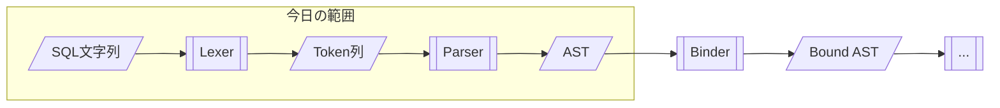

この記事は「[一人自作RDBMS Advent Calendar 2025](https://qiita.com/advent-calendar/2025/my-own-rdbms)」4日目の記事です。

本日の実装は[GitHub](https://github.com/gtnao/advent-calendar-2025-my-own-rdbms/tree/main/day04)にあります。昨日からの差分は以下のコマンドで確認できます。

```bash
git diff --no-index day03 day04
```

## 今日のゴール

`SELECT * FROM users WHERE id > 10`のようなSQL文字列を解析し、**AST（Abstract Syntax Tree）**に変換するParserを実装します。

## SQL処理の流れ

SQLがどのように処理されるかの全体像を見てみましょう。



今日はLexerとParserを実装します。

歴史的には、Lexerには[lex](https://en.wikipedia.org/wiki/Lex_(software))/[flex](https://github.com/westes/flex)、Parserには[yacc](https://en.wikipedia.org/wiki/Yacc)/[bison](https://www.gnu.org/software/bison/)といったジェネレータが広く使われてきました。文法を定義ファイルに書くと、LexerやParserのコードを自動生成してくれます。今回は仕組みを理解するために手書きで実装してみます。

## Lexer（字句解析）

Lexerは文字列を**Token**（意味のある最小単位）に分解します。空白は読み飛ばされ、各部分が対応するTokenに変換されます。

```
SELECT     *         FROM    users            WHERE    id            >    10
   ↓       ↓          ↓        ↓                ↓       ↓            ↓     ↓
Select  Asterisk    From   Ident("users")    Where  Ident("id")     Gt  Integer(10)
```

### peek と advance

Lexerは文字列を1文字ずつ読み進めます。基本的な操作は2つです。

- `peek()`: 現在位置の文字を見る（位置は進めない）
- `advance()`: 現在位置の文字を消費して次に進む

```rust
pub struct Lexer {
    input: Vec<char>,
    pos: usize,
}

impl Lexer {
    fn peek(&self) -> Option<char> {
        self.input.get(self.pos).copied()
    }

    fn advance(&mut self) -> Option<char> {
        let ch = self.peek();
        self.pos += 1;
        ch
    }
}
```

### 先読み（Lookahead）

1文字だけでは判断できない場合があります。`<`を見たとき、それが`<`（Lt）なのか`<=`（Le）なのか`<>`（Ne）なのかは、次の文字を見ないとわかりません。

```rust
'<' => {
    self.advance();  // '<'を消費
    if self.peek() == Some('=') {
        self.advance();  // '='も消費
        Token::Le        // <=
    } else if self.peek() == Some('>') {
        self.advance();  // '>'も消費
        Token::Ne        // <>
    } else {
        Token::Lt        // < だけ
    }
}
```

同様に`>`も`>=`との区別が必要です。

### Token定義

Tokenはキーワード、識別子、リテラル、記号に分類されます。

```rust
#[derive(Debug, Clone, PartialEq)]
pub enum Token {
    // Keywords
    Select, From, Where, Insert, Into, Values,
    Create, Table, Int, Varchar,
    And, Or, Not, Null, True, False,

    // Identifiers and literals
    Ident(String),
    Integer(i64),
    String(String),

    // Symbols
    Asterisk, Comma, Semicolon, LParen, RParen,
    Eq, Ne, Lt, Le, Gt, Ge,  // 比較演算子
    Plus, Minus, Slash,       // 算術演算子

    Eof,
}
```

### キーワードと識別子

`SELECT`や`users`のような英字列は、まず全体を読み取ってからキーワードかどうかを判定します。

```rust
fn read_ident_or_keyword(&mut self) -> Result<Token> {
    let mut s = String::new();
    while let Some(ch) = self.peek() {
        if ch.is_ascii_alphanumeric() || ch == '_' {
            s.push(ch);
            self.advance();
        } else {
            break;
        }
    }
    // SQLは大文字小文字を区別しないので正規化
    let token = match s.to_uppercase().as_str() {
        "SELECT" => Token::Select,
        "FROM" => Token::From,
        "WHERE" => Token::Where,
        // ... 他のキーワード
        _ => Token::Ident(s),  // キーワードでなければ識別子
    };
    Ok(token)
}
```

## AST（抽象構文木）

ASTはSQLの構文構造を表現する**木構造**です。なぜ木構造が必要なのでしょうか？

`a + b * c`という式を考えます。これは`a + (b * c)`と解釈されるべきです（乗算が優先）。この構造を表現するには木が必要です。

```
    +
   / \
  a   *
     / \
    b   c
```

### Statement

SQL文全体を表す型です。

```rust
#[derive(Debug, Clone, PartialEq)]
pub enum Statement {
    Select(SelectStatement),
    Insert(InsertStatement),
    CreateTable(CreateTableStatement),
}

#[derive(Debug, Clone, PartialEq)]
pub struct SelectStatement {
    pub columns: Vec<SelectColumn>,
    pub from: String,
    pub where_clause: Option<Expr>,
}
```

### Expr（式）

式は再帰的な構造を持ちます。`id = 1 AND name = 'Alice'`のような式では、`AND`の左右にさらに式（比較式）が入ります。

```rust
#[derive(Debug, Clone, PartialEq)]
pub enum Expr {
    Literal(Literal),           // 1, 'Alice', NULL など
    Column(String),             // id, name など
    BinaryOp {                  // 二項演算: left op right
        left: Box<Expr>,
        op: BinaryOperator,
        right: Box<Expr>,
    },
    UnaryOp {                   // 単項演算: op expr
        op: UnaryOperator,
        expr: Box<Expr>,
    },
}
```

Rustでは型のサイズをコンパイル時に決定する必要がありますが、`Expr`が直接`Expr`を含むと、入れ子の深さによってサイズが無限に膨らむ可能性があり決定できません。`Box<Expr>`はヒープへのポインタなのでサイズが固定され、この問題を回避できます。

## Parser（構文解析）

TokenをASTに変換します。**再帰下降構文解析**を使います。

### peek と advance（Parser版）

Lexerと同様に、Parserも`peek`と`advance`でTokenを読み進めます。

```rust
pub struct Parser {
    tokens: Vec<Token>,
    pos: usize,
}

impl Parser {
    fn peek(&self) -> &Token {
        self.tokens.get(self.pos).unwrap_or(&Token::Eof)
    }

    fn advance(&mut self) -> &Token {
        self.pos += 1;
        self.tokens.get(self.pos - 1).unwrap_or(&Token::Eof)
    }
}
```

### 再帰下降構文解析

再帰下降構文解析では、文法規則をそのまま関数として実装します。例えばSELECT文の規則は:

```
SELECT文 = "SELECT" カラムリスト "FROM" テーブル名 ["WHERE" 式]
```

これをそのままコードにすると:

```rust
fn parse_select(&mut self) -> Result<Statement> {
    self.expect(Token::Select)?;           // "SELECT"
    let columns = self.parse_columns()?;   // カラムリスト
    self.expect(Token::From)?;             // "FROM"
    let table = self.parse_ident()?;       // テーブル名
    let where_clause = if self.peek() == &Token::Where {
        self.advance();
        Some(self.parse_expr()?)           // ["WHERE" 式]
    } else {
        None
    };
    Ok(Statement::Select(SelectStatement { columns, from: table, where_clause }))
}
```

### 演算子の優先順位

式のパースで最も重要なのは演算子の優先順位です。`a + b * c`は`a + (b * c)`と解釈されるべきです。

優先順位（低い順）:

1. `OR`
2. `AND`
3. 比較演算子 (`=`, `<`, `>`, `<=`, `>=`, `<>`)
4. 加減算 (`+`, `-`)
5. 乗除算 (`*`, `/`)
6. 単項演算子 (`NOT`, `-`)
7. 基本要素（リテラル、カラム参照、括弧）

再帰下降構文解析の優れた点は、**優先順位を関数の呼び出し階層で表現できる**ことです。

```rust
fn parse_expr(&mut self) -> Result<Expr> { self.parse_or() }

fn parse_or(&mut self) -> Result<Expr> {
    let mut left = self.parse_and()?;  // より高い優先順位を先にパース
    while self.peek() == &Token::Or {
        self.advance();
        let right = self.parse_and()?;
        left = Expr::BinaryOp {
            left: Box::new(left), op: BinaryOperator::Or, right: Box::new(right),
        };
    }
    Ok(left)
}

fn parse_and(&mut self) -> Result<Expr> {
    let mut left = self.parse_comparison()?;
    while self.peek() == &Token::And {
        self.advance();
        let right = self.parse_comparison()?;
        left = Expr::BinaryOp {
            left: Box::new(left), op: BinaryOperator::And, right: Box::new(right),
        };
    }
    Ok(left)
}

// parse_comparison → parse_additive → parse_multiplicative → parse_unary → parse_primary
```

`a + b * c`をパースする流れ:

1. `parse_additive`が呼ばれる
2. まず`parse_multiplicative`を呼んで左辺を取得 → `a`
3. `+`があるので、右辺を`parse_multiplicative`で取得
4. `parse_multiplicative`内で`b * c`が処理され、`Mul(b, c)`として返る
5. 結果: `Add(a, Mul(b, c))`

低い優先順位の関数が高い優先順位の関数を呼び出すことで、自動的に正しい木構造が構築されます。

## 動作確認

様々なSQLをパースしてみます。

```rust
let sqls = vec![
    "SELECT * FROM users",
    "SELECT id, name FROM users WHERE id > 10",
    "SELECT id FROM users WHERE id = 1 AND name = 'Alice'",
    "INSERT INTO users VALUES (1, 'Alice')",
    "CREATE TABLE users (id INT, name VARCHAR)",
    "SELECT a + b * c FROM t",
];

for sql in sqls {
    println!("SQL: {sql}");
    match parse(sql) {
        Ok(stmt) => println!("AST: {stmt:#?}\n"),
        Err(e) => println!("Error: {e}\n"),
    }
}
```

実行結果（一部抜粋）:

```
SQL: SELECT id FROM users WHERE id = 1 AND name = 'Alice'
AST: Select(
    SelectStatement {
        columns: [
            Expr(
                Column(
                    "id",
                ),
            ),
        ],
        from: "users",
        where_clause: Some(
            BinaryOp {
                left: BinaryOp {
                    left: Column(
                        "id",
                    ),
                    op: Eq,
                    right: Literal(
                        Integer(
                            1,
                        ),
                    ),
                },
                op: And,
                right: BinaryOp {
                    left: Column(
                        "name",
                    ),
                    op: Eq,
                    right: Literal(
                        String(
                            "Alice",
                        ),
                    ),
                },
            },
        ),
    },
)

SQL: SELECT a + b * c FROM t
AST: Select(
    SelectStatement {
        columns: [
            Expr(
                BinaryOp {
                    left: Column(
                        "a",
                    ),
                    op: Add,
                    right: BinaryOp {
                        left: Column(
                            "b",
                        ),
                        op: Mul,
                        right: Column(
                            "c",
                        ),
                    },
                },
            ),
        ],
        from: "t",
        where_clause: None,
    },
)
```

`id = 1 AND name = 'Alice'`が正しくANDの左右に分解されています。また、`a + b * c`では乗算が先に結合され、`a + (b * c)`という構造になっていることが確認できます。

## 現時点の課題

Lexerにより文字列がTokenに分割され、Parserにより構文的に正しいかチェックされるようになりました。`SELECT FROM`のような文法エラーは検出できます。

しかし、実行可能なSQLとしてはまだ検証が足りません。

- `SELECT * FROM users` の `users` というテーブルは本当に存在するか？
- `SELECT name FROM users` の `name` というカラムは `users` テーブルに存在するか？
- `WHERE id > 'hello'` のように、型が合わない比較をしていないか？

これらはデータベースのスキーマ（カタログ）を参照しないとわかりません。

## 次回予告

明日は**Binder**を実装します。

ASTに含まれる識別子（テーブル名、カラム名）をカタログと照合して解決し、型情報を付与したBound ASTを生成します。
