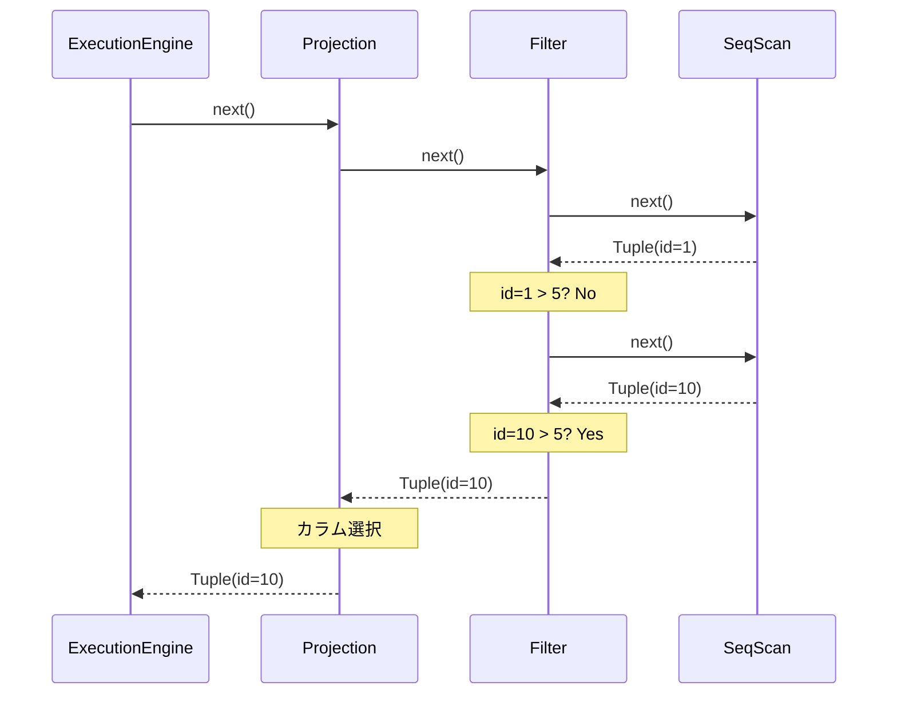

この記事は「[一人自作RDBMS Advent Calendar 2025](https://qiita.com/advent-calendar/2025/my-own-rdbms)」6日目の記事です。

本日の実装は[GitHub](https://github.com/gtnao/advent-calendar-2025-my-own-rdbms/tree/main/day06)にあります。昨日からの差分は以下のコマンドで確認できます。

```bash
git diff --no-index day05 day06
```

## 今日のゴール

**Executor**を実装します。day01〜03で作ったデータの読み書き部分と、day04〜05で作ったSQL解析部分を繋ぎ込み、SQLを実行して結果を返せるようにします。

## Volcanoモデル

クエリ実行の方式にはいくつかあります。近年ではベクトル化実行など効率的な方式も登場していますが、今回は最も基本的な**Volcanoモデル**（イテレータモデル）を実装します。[Volcano - An Extensible and Parallel Query Evaluation System](https://paperhub.s3.amazonaws.com/dace52a42c07f7f8348b08dc2b186061.pdf)で提唱された古典的な方式です。

Volcanoモデルでは、各演算子（Executor）が`open`/`next`インターフェースを持ちます。

```rust
pub trait Executor {
    fn open(&mut self) -> Result<()>;
    fn next(&mut self) -> Result<Option<Tuple>>;
}
```

- `open`: 初期化処理
- `next`: 次の行を返す。なければ`None`

このシンプルなインターフェースにより、各Executorを部品として組み合わせやすくなります。

## Executorの木構造

`SELECT * FROM users WHERE id > 5`を考えます。このクエリは以下のExecutor木に変換されます。

```
ProjectionExecutor (SELECT句の式を評価)
         ↑
    FilterExecutor (WHERE id > 5)
         ↑
    SeqScanExecutor (usersテーブルをスキャン)
```

各Executorは子の`next`を呼び、その結果を処理して親に渡します。



`next()`の呼び出しが上から下に伝播し、Tupleが下から上に返されます。Filterで条件を満たさない行は、再度子の`next()`を呼んでスキップします。

## Executor実装

### SeqScanExecutor

テーブルの全行を順番にスキャンします。day03で実装したBuffer Pool Manager経由でPageを取得し、day02で実装したSlotted Pageから各Tupleを読み取ります。

```rust
pub struct SeqScanExecutor<'a> {
    bpm: &'a mut BufferPoolManager,
    current_page_id: u32,
    current_slot_id: u16,
    // ...
}
```

`next`が呼ばれるたびに`current_page_id`と`current_slot_id`を進めながら次の行を返します。

```rust
fn next(&mut self) -> Result<Option<Tuple>> {
    while self.current_page_id < page_count {
        let page = self.bpm.fetch_page(self.current_page_id)?;
        if let Some(tuple_data) = page.get_tuple(self.current_slot_id) {
            // Tupleを返して次のスロットへ
            self.current_slot_id += 1;
            return Ok(Some(Tuple::new(deserialize_tuple(tuple_data, &schema)?)));
        }
        // 次のページへ
        self.current_page_id += 1;
        self.current_slot_id = 0;
    }
    Ok(None)
}
```

### FilterExecutor

WHERE句の条件でフィルタリングします。

```rust
pub struct FilterExecutor<'a> {
    child: Box<dyn Executor + 'a>,
    predicate: AnalyzedExpr,
}

impl Executor for FilterExecutor<'_> {
    fn next(&mut self) -> Result<Option<Tuple>> {
        while let Some(tuple) = self.child.next()? {
            if evaluate_predicate(&self.predicate, &tuple)? {
                return Ok(Some(tuple));
            }
        }
        Ok(None)
    }
}
```

子から行を取得し、条件を満たす行だけを返します。満たさない行はスキップして次を取得します。

### ProjectionExecutor

SELECT句の式を評価します。

```rust
pub struct ProjectionExecutor<'a> {
    child: Box<dyn Executor + 'a>,
    exprs: Vec<AnalyzedExpr>,
}

impl Executor for ProjectionExecutor<'_> {
    fn next(&mut self) -> Result<Option<Tuple>> {
        if let Some(tuple) = self.child.next()? {
            let projected: Vec<Value> = self
                .exprs
                .iter()
                .map(|expr| evaluate_expr(expr, &tuple))
                .collect::<Result<Vec<_>>>()?;
            return Ok(Some(Tuple::new(projected)));
        }
        Ok(None)
    }
}
```

`SELECT id + 1`のような式も、ここで評価されます。

### InsertExecutor

INSERT文を処理します。day01で実装したTupleのシリアライズ、day02のSlotted Pageへの挿入、day03のBuffer Pool Managerを組み合わせて、データを永続化します。

```rust
fn next(&mut self) -> Result<Option<Tuple>> {
    if self.executed {
        return Ok(None);
    }
    self.executed = true;

    let tuple_data = serialize_tuple(&self.values);

    // 最後のPageに空きがあれば挿入、なければ新規Page
    // ...
    page.insert(&tuple_data)?;

    Ok(Some(Tuple::new(vec![Value::Int(1)]))) // 1 row inserted
}
```

INSERTは一度だけ実行され、挿入した行数（1）を返します。

## 式の評価

カラム参照や演算式を評価する関数です。

```rust
fn evaluate_expr(expr: &AnalyzedExpr, tuple: &Tuple) -> Result<Value> {
    match expr {
        AnalyzedExpr::Literal(lit) => Ok(literal_to_value(lit)),
        AnalyzedExpr::ColumnRef(col_ref) => Ok(tuple.values[col_ref.column_index].clone()),
        AnalyzedExpr::BinaryOp { left, op, right, .. } => {
            let left_val = evaluate_expr(left, tuple)?;
            let right_val = evaluate_expr(right, tuple)?;
            evaluate_binary_op(op, &left_val, &right_val)
        }
        AnalyzedExpr::UnaryOp { op, expr, .. } => {
            let val = evaluate_expr(expr, tuple)?;
            evaluate_unary_op(op, &val)
        }
    }
}
```

Analyzerが解決した`column_index`を使って、Tupleから直接値を取得できます。

## Executor木の構築

Analyzed ASTからExecutor木を構築します。

```rust
fn build_select_executor(
    bpm: &'a mut BufferPoolManager,
    catalog: &'a Catalog,
    stmt: &AnalyzedSelectStatement,
) -> Box<dyn Executor + 'a> {
    let rte = &stmt.range_table[stmt.from_rte_index];
    let table_id = match &rte.source {
        TableSource::BaseTable { table_id, .. } => *table_id,
    };

    // SeqScan
    let scan: Box<dyn Executor> = Box::new(SeqScanExecutor::new(bpm, catalog, table_id));

    // Filter (if WHERE clause exists)
    let filtered: Box<dyn Executor> = if let Some(pred) = &stmt.where_clause {
        Box::new(FilterExecutor::new(scan, pred.clone()))
    } else {
        scan
    };

    // Projection
    let exprs: Vec<AnalyzedExpr> = stmt
        .select_items
        .iter()
        .map(|item| item.expr.clone())
        .collect();

    Box::new(ProjectionExecutor::new(filtered, exprs))
}
```

WHERE句がなければFilterをスキップし、SeqScanの上に直接Projectionを載せます。

## 動作確認

INSERTでデータを挿入し、様々なSELECTを実行します。

```rust
execute_sql("INSERT INTO users VALUES (1, 'Alice')", &catalog, &mut bpm)?;
execute_sql("INSERT INTO users VALUES (2, 'Bob')", &catalog, &mut bpm)?;
execute_sql("INSERT INTO users VALUES (3, 'Charlie')", &catalog, &mut bpm)?;
execute_sql("INSERT INTO users VALUES (10, 'Dave')", &catalog, &mut bpm)?;
execute_sql("INSERT INTO users VALUES (20, 'Eve')", &catalog, &mut bpm)?;
```

実行結果:

```
SQL: SELECT * FROM users
  Tuple { values: [Int(1), Varchar("Alice")] }
  Tuple { values: [Int(2), Varchar("Bob")] }
  Tuple { values: [Int(3), Varchar("Charlie")] }
  Tuple { values: [Int(10), Varchar("Dave")] }
  Tuple { values: [Int(20), Varchar("Eve")] }

SQL: SELECT name FROM users
  Tuple { values: [Varchar("Alice")] }
  Tuple { values: [Varchar("Bob")] }
  Tuple { values: [Varchar("Charlie")] }
  Tuple { values: [Varchar("Dave")] }
  Tuple { values: [Varchar("Eve")] }

SQL: SELECT * FROM users WHERE id > 5
  Tuple { values: [Int(10), Varchar("Dave")] }
  Tuple { values: [Int(20), Varchar("Eve")] }

SQL: SELECT id, name FROM users WHERE id >= 2 AND id <= 10
  Tuple { values: [Int(2), Varchar("Bob")] }
  Tuple { values: [Int(3), Varchar("Charlie")] }
  Tuple { values: [Int(10), Varchar("Dave")] }

SQL: SELECT id + 1 FROM users
  Tuple { values: [Int(2)] }
  Tuple { values: [Int(3)] }
  Tuple { values: [Int(4)] }
  Tuple { values: [Int(11)] }
  Tuple { values: [Int(21)] }
```

WHERE句によるフィルタリング、カラム選択、式の評価が正しく動作しています。

## 次回予告

ここまででSQL文字列から実行まで一通りできるようになりました。明日は**PostgreSQLプロトコル**を簡易実装し、`psql`コマンドから接続できるようにします。
