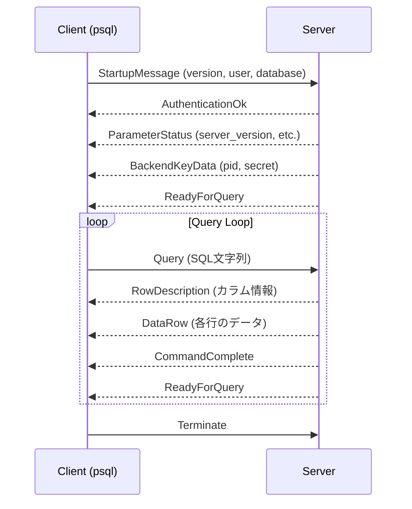
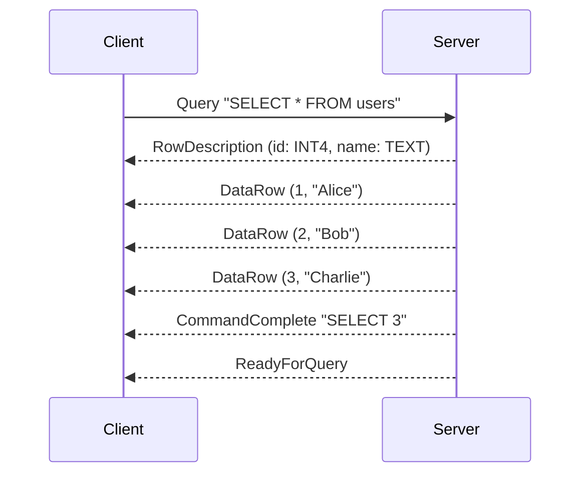

この記事は「[一人自作RDBMS Advent Calendar 2025](https://qiita.com/advent-calendar/2025/my-own-rdbms)」7日目の記事です。

本日の実装は[GitHub](https://github.com/gtnao/advent-calendar-2025-my-own-rdbms/tree/main/day07)にあります。昨日からの差分は以下のコマンドで確認できます。

```bash
git diff --no-index day06 day07
```

## 今日のゴール

**PostgreSQL Wire Protocol**を簡易実装し、`psql`コマンドから接続できるようにします。

ここまでで、SQL文字列をパースして実行し、結果を返すところまでできました。今日はそれをネットワーク越しに呼び出せるようにします。

## PostgreSQL Wire Protocolとは

PostgreSQLのクライアント（フロントエンド）とサーバ（バックエンド）間の通信プロトコルです。TCPソケット上でメッセージをやり取りします。

プロトコルの詳細は[公式ドキュメント](https://www.postgresql.org/docs/current/protocol.html)で定義されています。

### 今回実装するメッセージ

PostgreSQL Wire Protocolには多くのメッセージ種別がありますが、今回は最低限のSimple Query Protocolに必要なものだけを実装します。

| 方向 | Type | 名前 | 説明 |
|------|------|------|------|
| F→B | - | StartupMessage | 接続開始。プロトコルバージョン、ユーザー名等を送信 |
| F→B | Q | Query | SQL文字列を送信 |
| F→B | X | Terminate | 接続終了 |
| B→F | R | AuthenticationOk | 認証成功 |
| B→F | S | ParameterStatus | サーバパラメータ（server_version等） |
| B→F | K | BackendKeyData | バックエンドのPIDとシークレットキー |
| B→F | Z | ReadyForQuery | クエリ受付準備完了 |
| B→F | T | RowDescription | SELECT結果のカラム情報 |
| B→F | D | DataRow | SELECT結果の各行 |
| B→F | C | CommandComplete | コマンド完了（`SELECT 3`等） |
| B→F | E | ErrorResponse | エラー情報 |

F=Frontend（クライアント）、B=Backend（サーバ）

## メッセージ構造

全ての通信はメッセージ単位で行われます。各メッセージは以下の構造を持ちます。

```
+--------+--------+------------------+
| Type   | Length | Data             |
| (1byte)| (4byte)| (variable)       |
+--------+--------+------------------+
```

- **Type**: メッセージの種類を示す1バイト（例: `Q`=Query, `R`=Authentication）
- **Length**: データ部分の長さ + 4（この長さフィールド自身を含む）
- **Data**: メッセージ固有のデータ

[公式ドキュメント](https://www.postgresql.org/docs/current/protocol-overview.html)にあるように、スタートアップメッセージだけは歴史的な理由でTypeバイトがありません。

> For historical reasons, the very first message sent by the client (the startup message) has no initial message-type byte.

詳細は[Message Formats](https://www.postgresql.org/docs/current/protocol-message-formats.html)を参照してください。

## 接続の流れ



今回はSimple Query Protocolのみ実装します。Extended Query Protocol（プリペアドステートメント等）は省略しています。

## 実装

### TCPサーバ

まず、TCPで接続を待ち受けるサーバ部分です。

```rust
pub fn start(&mut self) -> Result<()> {
    let listener = TcpListener::bind("127.0.0.1:5433")?;

    for stream in listener.incoming() {
        match stream {
            Ok(stream) => {
                let conn = Connection::new(stream);
                self.handle_client(conn)?;
            }
            Err(e) => println!("Accept error: {e}"),
        }
    }
    Ok(())
}
```

`TcpListener::bind`でポート5433をlistenし、`incoming()`で接続を待ちます。接続が来たら`handle_client`でその接続を処理します。

現在の実装では`for stream in listener.incoming()`で順番に処理しているため、1つの接続を処理している間は他の接続を受け付けられません。並行処理については後日実装予定です。

### メッセージの読み書き

```rust
pub struct Connection {
    stream: TcpStream,
}

impl Connection {
    fn write_message(&mut self, msg_type: u8, data: &[u8]) -> Result<()> {
        let len = (data.len() + 4) as i32;
        self.stream.write_all(&[msg_type])?;
        self.stream.write_all(&len.to_be_bytes())?;
        self.stream.write_all(data)?;
        self.stream.flush()?;
        Ok(())
    }
}
```

PostgreSQLはビッグエンディアンを使うので、`to_be_bytes()`で変換します。

### スタートアップ処理

クライアントからの接続時、まずStartupMessageを受け取ります。

```rust
pub fn read_startup(&mut self) -> Result<StartupMessage> {
    let len = self.read_i32()? as usize;
    let protocol_version = self.read_i32()?;

    if protocol_version == 80877103 {
        // SSLRequest - SSLは未サポートなので'N'を返す
        self.stream.write_all(b"N")?;
        return self.read_startup();
    }
    // パラメータ（user, database等）を読み取り...
}
```

`psql`は最初にSSL接続を試みるため、SSLRequestを受け取ったら`N`（非対応）を返して通常の接続に切り替えます。

その後、AuthenticationOkやReadyForQueryを送信して接続を確立します。今回は簡略化のためSSLには対応せず、認証もチェックせずに常にOKを返しています。

### クエリ処理

Query(`Q`)メッセージを受け取ったら、SQLを実行して結果を返します。

```rust
match conn.read_message()? {
    Some(FrontendMessage::Query(sql)) => {
        match self.execute_sql(&sql) {
            Ok(result) => {
                // SELECT結果があればRowDescription + DataRowを送信
                if !result.columns.is_empty() {
                    conn.send_row_description(&result.columns)?;
                    for row in &result.rows {
                        conn.send_data_row(row)?;
                    }
                }
                conn.send_command_complete(&result.command_tag)?;
            }
            Err(e) => {
                conn.send_error(&e.to_string())?;
            }
        }
        conn.send_ready_for_query()?;
    }
    // ...
}
```

SELECTの場合、以下のメッセージを順に送信します。



- **RowDescription**: カラム名、型OID、サイズなどのメタ情報。クライアントはこれを見て結果の解釈方法を知る
- **DataRow**: 各行のデータ。今回はテキスト形式で送信
- **CommandComplete**: `SELECT 3`のような完了タグ。処理した行数を含む
- **ReadyForQuery**: 次のクエリを受け付ける準備完了

### 型OID

RowDescriptionでは各カラムの型をOID（Object ID）で伝えます。

```rust
impl ColumnDesc {
    pub fn new_int(name: &str) -> Self {
        ColumnDesc {
            name: name.to_string(),
            type_oid: 23,  // INT4
            type_size: 4,
        }
    }

    pub fn new_varchar(name: &str) -> Self {
        ColumnDesc {
            name: name.to_string(),
            type_oid: 25,  // TEXT
            type_size: -1, // variable length
        }
    }
}
```

PostgreSQLの型OIDは[pg_type](https://www.postgresql.org/docs/current/catalog-pg-type.html)システムカタログで定義されています。[ソースコード](https://github.com/postgres/postgres/blob/master/src/include/catalog/pg_type.dat)を見ると、INT4は23、TEXTは25などと決まっています。

## 動作確認

サーバを起動します。

```bash
$ cargo run
=== PostgreSQL Wire Protocol Server ===
Listening on port 5433
Connect with: psql -h localhost -p 5433
```

別のターミナルから`psql`で接続します。

```bash
$ psql -h localhost -p 5433
```

INSERTでデータを追加し、SELECTで取得できます。

```
$ psql -h localhost -p 5433

INSERT INTO users VALUES (1, 'Alice');
INSERT 0 1

INSERT INTO users VALUES (2, 'Bob');
INSERT 0 1

INSERT INTO users VALUES (3, 'Charlie');
INSERT 0 1

SELECT * FROM users;
 id |  name
----+---------
  1 | Alice
  2 | Bob
  3 | Charlie
(3 rows)

SELECT name FROM users;
  name
---------
 Alice
 Bob
 Charlie
(3 rows)

SELECT * FROM users WHERE id > 1;
 id |  name
----+---------
  2 | Bob
  3 | Charlie
(2 rows)

SELECT id + 1 FROM users;
 ?column?
----------
        2
        3
        4
(3 rows)
```

day06まで実装してきたParser、Analyzer、Executorが`psql`から呼び出せるようになりました。

## まとめと次回予告

ここまで1週間かけて、SQLを受け取り、実際にデータを読み書きして結果を返すところまで一通り実装できました。まだSELECTとINSERTだけの単純なものですが、`psql`から実行できるようになると、ちょっとした達成感があります。

ただし、重要なことを忘れています。RDBMSの根幹である**トランザクション**です。また、現在の実装ではTCPの接続を順番に処理しているため、同時に複数のリクエストを捌くこともできません。

来週からはいよいよトランザクションという深淵に踏み込む予定です。その前に、並行してリクエストを受け付ける仕組みを入れておきたいと思います。並行処理を入れると、トランザクションがなぜ必要かを身をもって体験できるはずです。また、UPDATE/DELETEもトランザクション実装時の動作確認に必要になるので、先に実装しておきます。

明日は**UDPATE/DELETE処理**を実装します。
