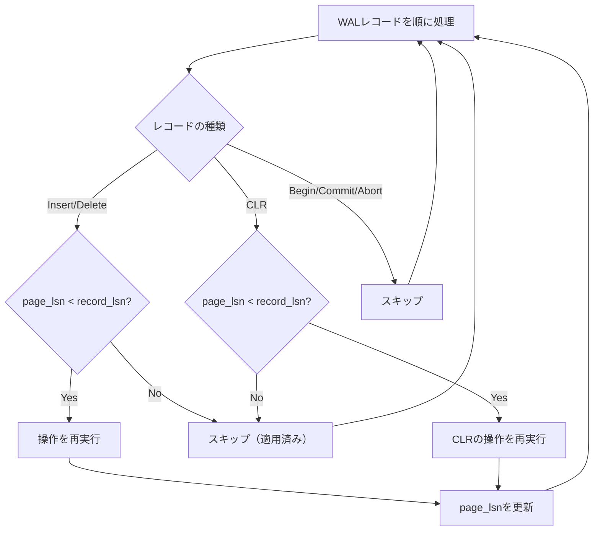
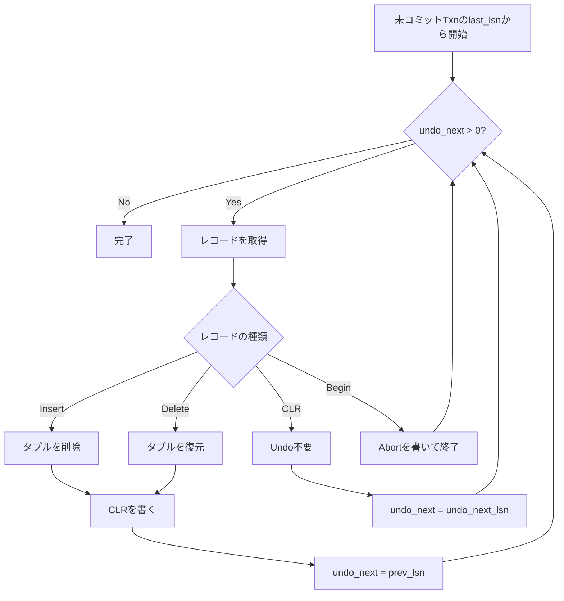

この記事は「[一人自作RDBMS Advent Calendar 2025](https://qiita.com/advent-calendar/2025/my-own-rdbms)」12日目の記事です。

本日の実装は[GitHub](https://github.com/gtnao/advent-calendar-2025-my-own-rdbms/tree/main/day12)にあります。昨日からの差分は以下のコマンドで確認できます。

```bash
git diff --no-index day11 day12
```

## 今日のゴール

昨日WALを実装しましたが、まだクラッシュ時に実際にデータを復元する機能がありません。今日は**ARIES**に基づくクラッシュリカバリを実装し、ACIDの**Durability**を完成させます。

## ARIES

WALにはデータベースの全ての変更履歴が記録されています。しかし、クラッシュ後にWALを使ってデータベースを正しい状態に復元するには、いくつかの課題があります。

1. **どのトランザクションがコミット済みか？** → コミット済みの変更はRedoで確実に反映
2. **どのトランザクションが未コミットか？** → 未コミットの変更はUndoで取り消し
3. **リカバリ中にクラッシュしたら？** → リカバリ自体も冪等でなければならない

**ARIES (Algorithm for Recovery and Isolation Exploiting Semantics)** はこれらの課題を解決する、広く使われているリカバリアルゴリズムです。1992年にIBMのMohanらによって発表されました。

> C. Mohan, et al. "[ARIES: A Transaction Recovery Method Supporting Fine-Granularity Locking and Partial Rollbacks Using Write-Ahead Logging](https://dl.acm.org/doi/10.1145/128765.128770)" (1992)

### 3つのフェーズ

ARIESは3つのフェーズで構成されます。


### 1. Analysis（分析フェーズ）

WALをある位置（今回はログの先頭）から最後までスキャンし、以下を特定します：

- **コミット済みトランザクション**: `Commit`レコードがある
- **未コミットトランザクション**: `Begin`はあるが`Commit`/`Abort`がない

本来のARIESではDirty Page Table（DPT）なども構築しますが、今回は簡略化しています。

### 2. Redo（再実行フェーズ）

WALを走査し、コミット済みかどうかに関わらず**全ての操作の再実行を試みます**。ただし、Page LSNを比較して既に適用済みの操作はスキップします（day11で説明した冪等性）。これにより、クラッシュ直前の状態が復元されます。

### 3. Undo（取り消しフェーズ）

未コミットトランザクションの操作を逆順に取り消します。このとき、**CLR（Compensation Log Record）** を書くことで、Undo自体もリカバリ可能にします。

### 今回の実装について

ARIESには**Fuzzy Checkpoint**という仕組みも含まれています。これは定期的にデータベースの状態（アクティブなトランザクション、ダーティページなど）を記録し、Analysisフェーズの開始位置を決定するものです。Checkpointがあれば、Checkpoint時点でアクティブだったトランザクションの最も古いLSNより前のWALは不要になるため、**WALを切り詰める（truncate）** ことができます。

しかし今回は、まずシンプルに**WALをログの先頭から最後までスキャンする愚直な方法**でリカバリを実現します。Checkpointなしでは全てのWALを保持し続ける必要があり、WALが蓄積されるとリカバリ時間が長くなりますが、まずは基本的なリカバリの仕組みを理解することを優先します。

Checkpointの実装は次回行う予定です。

## WALレコードの拡張

昨日実装したWALレコードを少し拡張します。

### PrevLSN

各WALレコードに`prev_lsn`フィールドを追加します。これは**同じトランザクション内の前のLSN**を指します。

```rust
pub struct WalRecord {
    pub lsn: Lsn,
    pub txn_id: u64,
    pub prev_lsn: Lsn,  // 同トランザクションの前のLSN（最初は0）
    pub record_type: WalRecordType,
}
```

`prev_lsn`により、トランザクションの操作を逆順にたどれます。Undoフェーズでこのチェーンを使います。


### CLR（Compensation Log Record）

Undoを実行したとき、その操作を記録するのが**CLR**です。CLRには2つの重要な情報があります：

```rust
WalRecordType::CLR {
    undo_next_lsn: Lsn,  // 次にUndoすべきLSN
    redo: CLRRedo,       // Undo操作の内容（Redoで使う）
}

pub enum CLRRedo {
    UndoInsert { rid: Rid },              // INSERTをUndoした（= DELETE）
    UndoDelete { rid: Rid, data: Vec<u8> }, // DELETEをUndoした（= RESTORE）
}
```

CLRがなぜ必要かを考えてみましょう。

**CLRがない場合の問題**:
1. T1が未コミットの状態でクラッシュ
2. リカバリでT1をUndo（操作を取り消し）
3. Undo中にまたクラッシュ
4. 再度リカバリ → **同じ操作を再度Undoしてしまう**

CLRがあれば、Undoした箇所を記録できるので、リカバリを再開しても同じ操作を二重にUndoしません。


### undo_next_lsnの役割

CLRの`undo_next_lsn`は「次にUndoすべきレコードのLSN」を指します。これは、Undoしたレコードの`prev_lsn`と同じ値になります。

Undoフェーズでは：
- 通常レコード → Undo実行、CLRを書き、`prev_lsn`をたどる
- CLR → Undo不要、`undo_next_lsn`をたどる

これにより、リカバリ中にクラッシュしても、CLRの`undo_next_lsn`から再開できます。

## Analysisフェーズの実装

WALをスキャンして、トランザクションの状態を分析します。

```rust
fn analyze(wal_records: &[WalRecord]) -> AnalysisResult {
    let mut active_txns: HashSet<u64> = HashSet::new();
    let mut committed_txns: HashSet<u64> = HashSet::new();
    let mut last_lsn_map: HashMap<u64, Lsn> = HashMap::new();

    for record in wal_records {
        last_lsn_map.insert(record.txn_id, record.lsn);

        match &record.record_type {
            WalRecordType::Begin => {
                active_txns.insert(record.txn_id);
            }
            WalRecordType::Commit => {
                active_txns.remove(&record.txn_id);
                committed_txns.insert(record.txn_id);
            }
            WalRecordType::Abort => {
                active_txns.remove(&record.txn_id);
            }
            _ => {}
        }
    }

    AnalysisResult {
        committed_txns,
        uncommitted_txns: active_txns,  // Beginはあるが終了していない
        last_lsn_map,  // 各トランザクションの最後のLSN
    }
}
```

`last_lsn_map`は、Undoフェーズで各トランザクションの最後の操作から逆順にたどるために使います。

## Redoフェーズの実装

WALを走査し（今回は最初から）、各操作の再実行を試みます。Page LSNと比較して、既に適用済みならスキップします。



ポイントは以下の2点です：

1. **Page LSNによるスキップ判定**: `page_lsn >= record_lsn`なら、その操作は既にページに反映されているのでスキップ
2. **CLRもRedoする**: CLRはUndoの記録ですが、Redo時には「Undoで行った操作」を再実行

```rust
fn should_redo(page_lsn: Lsn, record_lsn: Lsn) -> bool {
    page_lsn < record_lsn  // ページに未適用ならRedo
}
```


## Undoフェーズの実装

未コミットトランザクションの操作を逆順に取り消します。



アルゴリズムのポイント：

1. **CLRを書く**: Undo操作をCLRとして記録し、リカバリ中のクラッシュに備える
2. **prev_lsnチェーンをたどる**: 各レコードの`prev_lsn`で同一Txnの前の操作へ
3. **CLRはスキップ**: CLRに遭遇したら`undo_next_lsn`へジャンプ（既にUndoした範囲をスキップ）

```rust
// Undo時のCLR書き込み（核心部分）
match &record.record_type {
    WalRecordType::Insert { rid, .. } => {
        undo_insert(rid);  // タプルを削除
        wal_manager.append(CLR {
            undo_next_lsn: record.prev_lsn,  // 次にUndoすべきLSN
            redo: CLRRedo::UndoInsert { rid },
        });
    }
    WalRecordType::CLR { undo_next_lsn, .. } => {
        // CLRはUndo不要、undo_next_lsnへジャンプ
        next_lsn = *undo_next_lsn;
    }
    // ...
}
```


## 通常のROLLBACKでもCLRを書く

リカバリ時だけでなく、通常の`ROLLBACK`でもCLRを書きます。これにより、ROLLBACKした後にクラッシュしても、リカバリ時にCLRをRedoすることで正しく復元できます。

```rust
// ROLLBACK時のUndo処理（抜粋）
for entry in undo_log.into_iter().rev() {
    match entry {
        UndoLogEntry::Insert { prev_lsn, rid, .. } => {
            page.delete(rid.slot_id)?;           // タプルを削除
            wal_manager.append(CLR {             // CLRを書く
                undo_next_lsn: prev_lsn,
                redo: CLRRedo::UndoInsert { rid },
            });
        }
        // Delete も同様...
    }
}
```

UndoLogEntryには`prev_lsn`を追加し、CLRの`undo_next_lsn`を正しく設定できるようにしています。

```rust
pub enum UndoLogEntry {
    Insert { lsn: Lsn, prev_lsn: Lsn, rid: Rid, data: Vec<u8> },
    Delete { lsn: Lsn, prev_lsn: Lsn, rid: Rid, data: Vec<u8> },
}
```

## 動作確認

### Test 1: コミット済みトランザクションのリカバリ

```bash
# サーバー起動
cargo run -- --init

# データ投入してCOMMIT
psql -h localhost -p 5433
BEGIN;
INSERT INTO users VALUES (1, 'Alice');
INSERT INTO users VALUES (2, 'Bob');
COMMIT;
\q

# Ctrl+Cでサーバーを強制終了

# サーバー再起動（リカバリ実行）
cargo run
```

```
[Instance] Found 4 WAL records
[Recovery] Starting ARIES crash recovery...
[Recovery] Analysis: 1 committed, 0 uncommitted transactions
[Recovery] Redo: replayed 2 operations
[Recovery] Undo: rolled back 0 operations
[Recovery] Crash recovery completed.
```

```sql
-- データが復元されていることを確認
SELECT * FROM users;
```

```
 id | name
----+-------
  1 | Alice
  2 | Bob
(2 rows)
```

### Test 2: 未コミットトランザクションのUndo

```bash
# サーバー起動
cargo run -- --init

psql -h localhost -p 5433
-- まずAliceをCOMMIT
BEGIN;
INSERT INTO users VALUES (1, 'Alice');
COMMIT;

-- BobはCOMMITしない
BEGIN;
INSERT INTO users VALUES (2, 'Bob');
SELECT * FROM users;  -- AliceとBob両方見える
-- ここでCtrl+Cでpsqlを終了（COMMITせず）

# Ctrl+Cでサーバーも強制終了

# サーバー再起動
cargo run
```

```
[Recovery] Analysis: 1 committed, 1 uncommitted transactions
[Recovery] Redo: replayed 2 operations
[Recovery] Undo: rolled back 1 operations
[Recovery] Crash recovery completed.
```

```sql
SELECT * FROM users;
```

```
 id | name
----+-------
  1 | Alice
(1 row)
```

未コミットのBobがUndoで取り消され、Aliceだけが残っています。

### Test 3: ROLLBACKのリカバリ

```sql
BEGIN;
INSERT INTO users VALUES (3, 'Charlie');
SELECT * FROM users;  -- Charlieが見える
ROLLBACK;
SELECT * FROM users;  -- Charlieが消えている
```

この後サーバーを再起動しても、ROLLBACKが正しく永続化されています。これはROLLBACK時にCLRが書かれ、リカバリ時にそのCLRがRedoされるためです。

## 次回予告

今日でACIDのうちAtomicity、Isolation、Durabilityが揃いました。

明日は**Fuzzy Checkpoint**を実装し、ARIESを完成させます。これにより、リカバリ時にWAL全体をスキャンする必要がなくなり、実用的なリカバリ性能を実現します。
