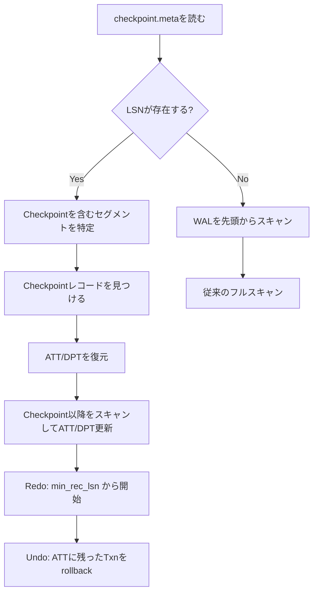

この記事は「[一人自作RDBMS Advent Calendar 2025](https://qiita.com/advent-calendar/2025/my-own-rdbms)」13日目の記事です。

本日の実装は[GitHub](https://github.com/gtnao/advent-calendar-2025-my-own-rdbms/tree/main/day13)にあります。昨日からの差分は以下のコマンドで確認できます。

```bash
git diff --no-index day12 day13
```

## 今日のゴール

昨日実装したリカバリ処理では、WALを先頭から全てスキャンしていました。WALが蓄積すると、リカバリ時間が線形に増加し、WALファイル自体も肥大化します。今日は**Checkpoint機能**、とりわけARIESで定義された**Fuzzy Checkpoint**を実装します。

## Checkpointの必要性

昨日の実装には以下の問題があります：

1. **リカバリ時間の増大**: WALを先頭から全てスキャンするため、運用期間が長くなるほどリカバリに時間がかかる
2. **WALの肥大化**: 古いWALを削除できないため、ディスク使用量が増え続ける

Checkpointを導入することで、「ここより前のWALはリカバリに不要」という地点を記録し、これらの問題を解決します。

## 愚直なCheckpoint

最もシンプルなCheckpoint方式を考えてみましょう。

### Quiescent Checkpoint

1. **新規トランザクションの受付を停止**
2. 実行中の全トランザクションの完了を待つ
3. 全てのダーティページをディスクに書き出す（flush）
4. CheckpointレコードをWALに書く
5. 新規トランザクションの受付を再開

この方式なら、Checkpoint時点で**アクティブなトランザクションは存在せず、全ての変更がディスクに反映されている**ことが保証されます。リカバリはCheckpoint以降のWALだけ見れば十分です。


しかしこの方式では、新規トランザクションをブロックし、長時間トランザクションの完了を待ち、大量のダーティページをflushする間、システムが完全に停止してしまいます。本番環境では許容できません。

## Fuzzy Checkpoint

**Fuzzy Checkpoint**は、システムを停止せずにCheckpointを取る方式で、ARIESの論文で定義されています。

> ARIES supports fuzzy checkpoints ... which do not require quiescing the database while checkpoint data is written to disk.
> ― C. Mohan, et al. "[ARIES: A Transaction Recovery Method Supporting Fine-Granularity Locking and Partial Rollbacks Using Write-Ahead Logging](https://dl.acm.org/doi/10.1145/128765.128770)" (1992)

### 基本アイデア

Fuzzy Checkpointでは、ダーティページのflushを行いません。代わりに、**リカバリに必要な情報だけを記録**します：

1. **ATT (Active Transaction Table)**: 現在アクティブなトランザクションの一覧と、各トランザクションの最後のLSN
2. **DPT (Dirty Page Table)**: 現在ダーティなページの一覧と、各ページが最初にダーティになった時のLSN（RecLSN）

これらのスナップショットを取得してWALに書き込むだけなので、処理は一瞬で終わります。


### なぜFuzzyでも大丈夫なのか

「ダーティページをflushしなくて本当に大丈夫？」「スナップショット取得中に状態が変わったら？」と思うかもしれません。Fuzzy Checkpointが成り立つ理由を説明します。

**スナップショットの不完全性は問題ない**

ATTやDPTのスナップショットを取得している最中にも、トランザクションは動き続けています。そのため、スナップショットは「ある瞬間の正確な状態」ではなく、多少の不整合を含む可能性があります。

しかしこれは問題になりません。Analysisフェーズでは、Checkpointレコード以降のWALをスキャンしてATT/DPTを更新するからです。スナップショット取得中に発生した変更も、Checkpoint以降のWALに記録されているため、Analysisフェーズ終了時には正しい状態に再構築されます。


**Redoフェーズの開始位置**

Checkpointを取った時点で、まだディスクに書き込まれていないページがあります。それがDPTに記録されています。DPT内の最小のRecLSN（`min_rec_lsn`）より前の変更は、必ずディスクに反映されています。なぜなら：

- RecLSNは「そのページが最初にダーティになった時のLSN」
- あるページがDPTにないなら、そのページはダーティでない（既にflush済み）
- DPTにあるページでも、RecLSN以前の変更は反映済み

したがって、Redoは`min_rec_lsn`から開始すれば十分です。

```
WAL:  [LSN=1] [LSN=2] [LSN=3] [LSN=4] [LSN=5] [LSN=6] [CHECKPOINT] [LSN=7] ...
                              ↑
                          min_rec_lsn
                          （ここからRedo開始）
```

**Undoフェーズの対象トランザクション**

ATTには、Checkpoint時点でアクティブだったトランザクションが記録されています。Analysisフェーズでは、このATTを初期状態として、Checkpoint以降のWALをスキャンしてATTを更新します。最終的にATTに残っているトランザクションが、Undoの対象です。

### ATTとDPTの詳細

#### ATT (Active Transaction Table)

| txn_id | last_lsn |
| ------ | -------- |
| 101    | 42       |
| 102    | 55       |

- **txn_id**: トランザクションID
- **last_lsn**: そのトランザクションが最後に書いたWALレコードのLSN

last_lsnは、Undoフェーズでprev_lsnチェーンをたどる起点になります。

#### DPT (Dirty Page Table)

| page_id | rec_lsn |
| ------- | ------- |
| 5       | 30      |
| 12      | 45      |

- **page_id**: ダーティなページのID
- **rec_lsn**: そのページが最初にダーティになった時のLSN（Recovery LSN）

rec_lsnは「このLSN以降の変更はディスク上のページに反映されていない可能性がある」ことを意味します。

## WALセグメント分割

### なぜセグメント分割が必要か

これまでの実装では、WALは単一のファイルでした。しかしこれには問題があります：

- **特定のLSNへのアクセスが非効率**: 例えばLSN=50000のレコードを読みたい場合、ファイル先頭から順番にスキャンして目的のレコードを探す必要がある
- **古いWALの削除が困難**: 単一ファイルでは、不要になった先頭部分だけを削除できない

一般的なDBMSでは、WALを複数のファイル（セグメント）に分割しています。今回の実装でもセグメント分割を導入しました。

### セグメント方式

WALを複数のファイル（セグメント）に分割します：

```
data/wal/
├── wal_000001.log
├── wal_000002.log
├── wal_000003.log  ← Checkpoint以降のWALはここから
└── wal_000004.log
```

Checkpointを取った後、不要になったセグメントを削除できます。

### 削除可能なWALの判定

「Checkpoint以前のWALは全て削除可能」ではありません。重要なのは**min_rec_lsn より前のWALが削除可能**という点です。

DPT内の最小RecLSNより前のWALレコードは、リカバリで参照されることがないため、安全に削除できます。

```
WALセグメント:
┌──────────┬──────────┬──────────┬──────────┐
│ Segment1 │ Segment2 │ Segment3 │ Segment4 │
│ LSN 1-50 │ LSN 51-100│LSN101-150│LSN151-200│
└──────────┴──────────┴──────────┴──────────┘
                            ↑          ↑
                       min_rec_lsn  Checkpoint
                       (LSN=120)   (LSN=180)

→ Segment1, Segment2 は削除可能（全LSN < min_rec_lsn）
→ Segment3, Segment4 は保持必要
```

リカバリ時に `min_rec_lsn` から読み込みを開始するには、そのLSNを含むセグメントを特定する必要があります。今回の実装ではシンプルに、各セグメントの**先頭レコードのLSN**を確認して判定しています。

## Checkpointレコード

WALに新しいレコードタイプを追加します。

```rust
WalRecordType::Checkpoint {
    att: HashMap<u64, Lsn>,  // txn_id -> last_lsn
    dpt: HashMap<u32, Lsn>,  // page_id -> rec_lsn
}
```

```
Checkpointレコード構造:
┌────────┬────────┬──────────┬──────┬─────────────────────────────────────┐
│  len   │  lsn   │  txn_id  │ type │              data                   │
│ 4bytes │ 8bytes │  8bytes  │1byte │            (variable)               │
└────────┴────────┴──────────┴──────┴─────────────────────────────────────┘
                                    │
                    ┌───────────────┴───────────────┐
                    ▼                               ▼
           ┌───────────────────┐         ┌───────────────────┐
           │       ATT         │         │       DPT         │
           │ count: 4bytes     │         │ count: 4bytes     │
           │ entries:          │         │ entries:          │
           │  txn_id: 8bytes   │         │  page_id: 4bytes  │
           │  last_lsn: 8bytes │         │  rec_lsn: 8bytes  │
           │  × count          │         │  × count          │
           └───────────────────┘         └───────────────────┘
```

Checkpointレコードには、取得時点のATTとDPTのスナップショットが含まれます。

## 実装

### TransactionManager

ATTを管理するために、TransactionManagerを新設します。

```rust
pub struct TransactionManager {
    next_txn_id: AtomicU64,
    att: Mutex<HashMap<u64, Lsn>>,  // txn_id -> last_lsn
}

impl TransactionManager {
    pub fn begin(&self) -> u64 {
        let txn_id = self.next_txn_id.fetch_add(1, Ordering::SeqCst);
        self.att.lock().unwrap().insert(txn_id, 0);
        txn_id
    }

    pub fn update_last_lsn(&self, txn_id: u64, lsn: Lsn) {
        if let Some(entry) = self.att.lock().unwrap().get_mut(&txn_id) {
            *entry = lsn;
        }
    }

    pub fn commit(&self, txn_id: u64) {
        self.att.lock().unwrap().remove(&txn_id);
    }

    pub fn abort(&self, txn_id: u64) {
        self.att.lock().unwrap().remove(&txn_id);
    }

    pub fn get_att_snapshot(&self) -> HashMap<u64, Lsn> {
        self.att.lock().unwrap().clone()
    }
}
```

### DPT管理

BufferPoolManagerにDPTを追加します。

```rust
pub struct BufferPoolManager {
    // ... 既存フィールド
    dirty_page_table: HashMap<u32, Lsn>,  // page_id -> rec_lsn
}

impl BufferPoolManager {
    // ページflush後にDPTから削除
    fn evict(&mut self, frame_id: usize) -> Result<()> {
        if frame.is_dirty {
            // ... flush処理
            self.dirty_page_table.remove(&old_page_id);
        }
    }

    // Checkpoint用にスナップショット取得
    pub fn get_dpt_snapshot(&self) -> HashMap<u32, Lsn> {
        self.dirty_page_table.clone()
    }

    // リカバリ時にDPTを復元
    pub fn restore_dpt(&mut self, dpt: HashMap<u32, Lsn>) {
        self.dirty_page_table = dpt;
    }
}
```

### CHECKPOINTの実行

```rust
fn perform_checkpoint(
    bpm: &Arc<Mutex<BufferPoolManager>>,
    wal_manager: &Arc<WalManager>,
    txn_manager: &Arc<TransactionManager>,
) -> Result<()> {
    // 1. ATTとDPTのスナップショットを取得
    let att = txn_manager.get_att_snapshot();
    let dpt = bpm.lock().unwrap().get_dpt_snapshot();

    // 2. CheckpointレコードをWALに書き込み
    let checkpoint_lsn = wal_manager.append(
        0,  // Checkpointはトランザクションに属さない
        0,  // prev_lsnなし
        WalRecordType::Checkpoint { att, dpt },
    );
    wal_manager.flush();

    // 3. checkpoint.metaにLSNを保存
    checkpoint::write_checkpoint_lsn(DATA_DIR, checkpoint_lsn)?;

    // 4. 不要なWALセグメントを削除
    if let Some(min_rec_lsn) = bpm.lock().unwrap().get_dpt_snapshot()
        .values().min().copied()
    {
        wal_manager.delete_segments_before(min_rec_lsn)?;
    }

    Ok(())
}
```

### リカバリの変更

Analysisフェーズの開始位置が変わります。



```rust
fn analyze(wal_records: &[WalRecord], checkpoint_lsn: Option<Lsn>) -> AnalysisResult {
    let mut att: HashMap<u64, Lsn> = HashMap::new();
    let mut dpt: HashMap<u32, Lsn> = HashMap::new();

    for record in wal_records {
        match &record.record_type {
            WalRecordType::Checkpoint { att: ckpt_att, dpt: ckpt_dpt } => {
                // Checkpointを見つけたらATT/DPTを復元
                if checkpoint_lsn == Some(record.lsn) {
                    att = ckpt_att.clone();
                    dpt = ckpt_dpt.clone();
                }
            }
            WalRecordType::Begin => {
                att.insert(record.txn_id, record.lsn);
            }
            WalRecordType::Commit | WalRecordType::Abort => {
                att.remove(&record.txn_id);
            }
            WalRecordType::Insert { rid, .. } | WalRecordType::Delete { rid, .. } => {
                att.insert(record.txn_id, record.lsn);  // last_lsnを更新
                dpt.entry(rid.page_id).or_insert(record.lsn);  // rec_lsnは最初のみ
            }
            // ...
        }
    }

    // Redoの開始位置を決定
    let redo_lsn = dpt.values().copied().min();
    AnalysisResult { att, dpt, redo_lsn }
}
```

## 動作確認

### Test 1: Checkpoint後のリカバリ

```bash
# サーバー起動
cargo run -- --init

psql -h localhost -p 5433
BEGIN;
INSERT INTO users VALUES (1, 'Alice');
COMMIT;

-- Checkpoint実行
CHECKPOINT;

BEGIN;
INSERT INTO users VALUES (2, 'Bob');
COMMIT;
\q

# Ctrl+Cでサーバーを強制終了
# サーバー再起動
cargo run
```

```
[Recovery] Checkpoint LSN: Some(5)
[Recovery] Starting ARIES crash recovery with checkpoint support...
[Recovery] Restored ATT (0 entries) and DPT (1 entries) from checkpoint
[Recovery] Analysis: 1 committed, 0 uncommitted transactions
[Recovery] DPT has 1 dirty pages, redo start LSN: Some(3)
[Recovery] Redo: replayed 1 operations
[Recovery] Undo: rolled back 0 operations
[Recovery] Crash recovery completed.
```

Checkpoint以降のWALのみをスキャンしてリカバリが完了しました。

### Test 2: 未コミットトランザクションがある状態でのCheckpoint

```bash
cargo run -- --init

psql -h localhost -p 5433

-- T1: コミット済み
BEGIN;
INSERT INTO users VALUES (1, 'Alice');
COMMIT;

-- T2: 未コミット状態でCheckpoint
BEGIN;
INSERT INTO users VALUES (2, 'Bob');
```

別ターミナルで：

```bash
psql -h localhost -p 5433
CHECKPOINT;
```

元のターミナルで：

```sql
-- T2を完了せずにサーバーを強制終了
```

```bash
# サーバー再起動
cargo run
```

```
[Recovery] Checkpoint LSN: Some(6)
[Recovery] Starting ARIES crash recovery with checkpoint support...
[Recovery] Restored ATT (1 entries) and DPT (1 entries) from checkpoint
[Recovery] Analysis: 1 committed, 1 uncommitted transactions
[Recovery] Undo: rolled back 1 operations
[Recovery] Crash recovery completed.
```

Checkpoint時点でアクティブだったT2がATTに記録されており、正しくUndoされました。

## 次回予告

今日でFuzzy Checkpointを実装し、ARIESに基づくリカバリ機能が完成しました。

明日は**MVCC（Multi-Version Concurrency Control）** を実装し、より高度な同時実行制御を実現します。
