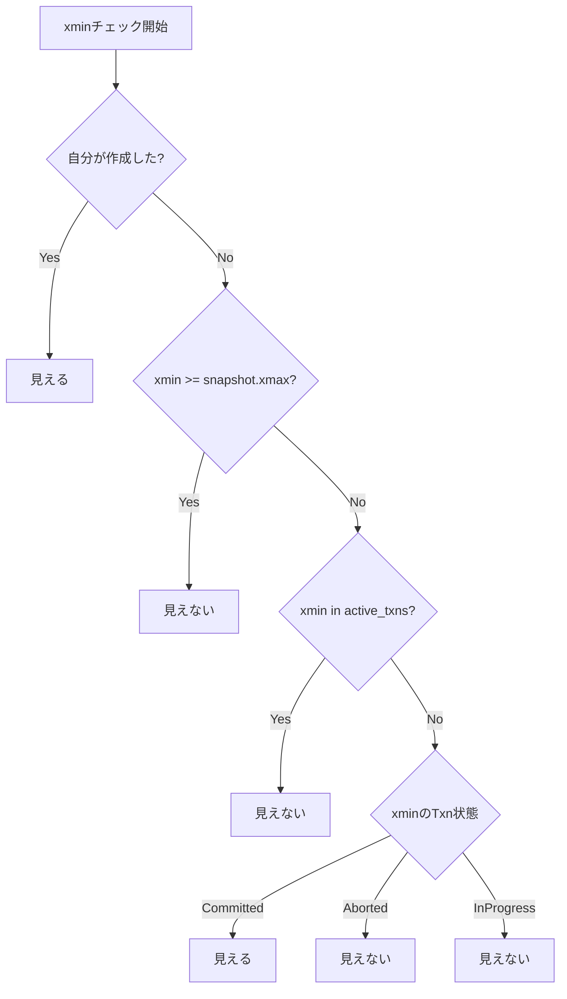
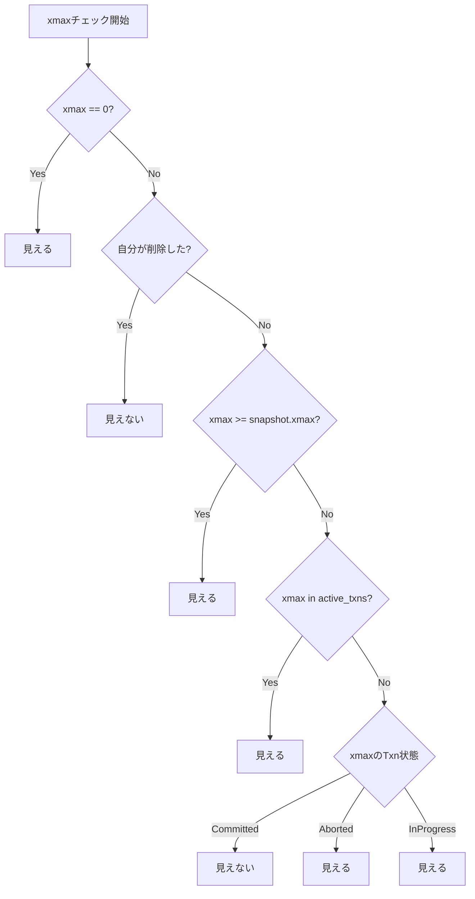

この記事は「[一人自作RDBMS Advent Calendar 2025](https://qiita.com/advent-calendar/2025/my-own-rdbms)」14日目の記事です。

本日の実装は[GitHub](https://github.com/gtnao/advent-calendar-2025-my-own-rdbms/tree/main/day14)にあります。昨日からの差分は以下のコマンドで確認できます。

```bash
git diff --no-index day13 day14
```

## 今日のゴール

これまでの実装では、同時実行制御に2PLを使用してきました。2PLはデータの一貫性を保証しますが、読み取りと書き込みが互いにブロックし合うため、並行性が制限されます。今日は**MVCC（Multi-Version Concurrency Control）** を実装し、読み取りが書き込みをブロックしない高い並行性を実現します。

## MVCCとは

**MVCC（Multi-Version Concurrency Control）** は、データの複数バージョンを保持することで、読み取りと書き込みの競合を回避する同時実行制御方式です。PostgreSQL、MySQL（InnoDB）、Oracleなど多くのDBMSで採用されており、今日では同時実行制御の主流となっています。

### 2PLとの比較

| 方式 | 読み取り vs 書き込み | 読み取り vs 読み取り | 書き込み vs 書き込み |
| ---- | -------------------- | -------------------- | -------------------- |
| 2PL  | ブロック             | 並行可能             | ブロック             |
| MVCC | **並行可能**         | 並行可能             | ブロック             |

MVCCでは、読み取りトランザクションは書き込みトランザクションをブロックせず、また書き込みトランザクションも読み取りトランザクションをブロックしません。各トランザクションは「スナップショット」を使って、どのバージョンのデータが見えるかを判定します。

## スナップショット

MVCCでは、トランザクションが「どのデータが見えるか」を決定するために**スナップショット**を使用します。スナップショットを取得するタイミングによって分離レベルが変わります：

- **READ COMMITTED**: 各ステートメント実行時にスナップショットを取得
- **REPEATABLE READ / Snapshot Isolation**: トランザクション開始時にスナップショットを取得し、終了まで保持

今回の実装では**REPEATABLE READ**相当の動作となっています。

### スナップショットの構成要素

スナップショットは以下の情報を持ちます：

- **自分のトランザクションID**: 自分が作成したデータは見える
- **xmin**: スナップショット取得時点でアクティブだった最小のトランザクションID
- **xmax**: スナップショット取得時点での次のトランザクションID
- **active_txns**: スナップショット取得時点でアクティブだったトランザクションIDの集合

```rust
pub struct Snapshot {
    pub txn_id: TxnId,           // 自分のトランザクションID
    pub xmin: TxnId,             // 最小のアクティブTxnID
    pub xmax: TxnId,             // 次のTxnID（これ以上は見えない）
    pub active_txns: HashSet<TxnId>,  // アクティブなTxnIDの集合
}
```

## タプルヘッダー

MVCCを実現するため、各タプル（行）にメタデータを追加します。PostgreSQLに倣い、**xmin**と**xmax**をヘッダーに持たせます。

```
タプル構造:
┌────────────────────────────────────────────────────────────┐
│                     MVCC Header                            │
├──────────────┬──────────────┬──────────────────────────────┤
│ xmin: 8bytes │ xmax: 8bytes │ Tuple Data (null bitmap + values) │
└──────────────┴──────────────┴──────────────────────────────┘
```

- **xmin**: このタプルを作成（INSERT）したトランザクションのID
- **xmax**: このタプルを削除（DELETE/UPDATE）したトランザクションのID（未削除なら0）

### 各操作でのxmin/xmaxの変化

| 操作   | xmin                                           | xmax          |
| ------ | ---------------------------------------------- | ------------- |
| INSERT | 実行したTxnID                                  | 0（未削除）   |
| DELETE | 変更なし                                       | 実行したTxnID |
| UPDATE | 旧タプル: xmaxをセット、新タプル: xminをセット |

UPDATEは「旧タプルの論理削除 + 新タプルのINSERT」として実装します。


## 可視性判定

あるタプルがトランザクションから「見える」かどうかを判定するロジックについて考えます。

### 判定ルール

タプルが見えるには、「xminが見える」かつ「xmaxが見えない」の両方を満たす必要があります。

**1. xminが見えるか？（このタプルを作成したTxnの変更が見えるか）**



**2. xmaxが見えないか？（このタプルを削除したTxnの変更が見えないか）**



### 実装

```rust
pub fn is_tuple_visible(
    xmin: TxnId,
    xmax: TxnId,
    snapshot: &Snapshot,
    txn_manager: &TransactionManager,
) -> bool {
    // 1. xminが見えるか？
    if !is_xmin_visible(xmin, snapshot, txn_manager) {
        return false;
    }

    // 2. xmaxのチェック
    if xmax == INVALID_TXN_ID {
        return true;  // 未削除
    }
    if xmax == snapshot.txn_id {
        return false; // 自分が削除した
    }
    if xmax >= snapshot.xmax {
        return true;  // スナップショット後に削除された
    }
    if snapshot.active_txns.contains(&xmax) {
        return true;  // 削除Txnがまだアクティブ
    }

    // 削除Txnの状態を確認
    match txn_manager.get_txn_status(xmax) {
        TxnStatus::Committed => false, // 削除がCommit済み → 見えない
        TxnStatus::Aborted => true,    // 削除がAbort済み → 見える
        TxnStatus::InProgress => true,
    }
}

fn is_xmin_visible(xmin: TxnId, snapshot: &Snapshot, txn_manager: &TransactionManager) -> bool {
    if xmin == snapshot.txn_id {
        return true;  // 自分が作成した
    }
    if xmin >= snapshot.xmax {
        return false; // スナップショット後に作成された
    }
    if snapshot.active_txns.contains(&xmin) {
        return false; // 作成Txnがまだアクティブ
    }

    // 作成Txnの状態を確認
    match txn_manager.get_txn_status(xmin) {
        TxnStatus::Committed => true,
        TxnStatus::Aborted => false,
        TxnStatus::InProgress => false,
    }
}
```

## 実装

MVCCを実装するには、以下の変更が必要です：

1. トランザクション状態の管理とスナップショット取得
2. タプルへのMVCCヘッダー追加
3. SELECTでの可視性チェック
4. DELETEを論理削除に変更

順に見ていきます。

### TransactionManager

可視性判定には「あるトランザクションがCommit済みかAbort済みか」を知る必要があります。そこでTransactionManagerにトランザクション状態を記録する機能を追加します。

```rust
#[derive(Debug, Clone, Copy, PartialEq, Eq)]
pub enum TxnStatus {
    InProgress,
    Committed,
    Aborted,
}

pub struct TransactionManager {
    next_txn_id: AtomicU64,
    att: Mutex<HashMap<u64, Lsn>>,                  // Active Transaction Table
    txn_status: Mutex<HashMap<TxnId, TxnStatus>>,  // 完了したTxnの状態
}
```

Commit/Abort時に状態を記録し、可視性判定時に参照できるようにします。

```rust
impl TransactionManager {
    pub fn commit(&self, txn_id: u64) {
        self.att.lock().unwrap().remove(&txn_id);
        self.txn_status.lock().unwrap().insert(txn_id, TxnStatus::Committed);
    }

    pub fn abort(&self, txn_id: u64) {
        self.att.lock().unwrap().remove(&txn_id);
        self.txn_status.lock().unwrap().insert(txn_id, TxnStatus::Aborted);
    }
}
```

また、スナップショット取得のメソッドを追加します。現在のATTから「アクティブなトランザクション一覧」を取得し、スナップショットを構築します。

```rust
impl TransactionManager {
    pub fn get_snapshot(&self, txn_id: TxnId) -> Snapshot {
        let att = self.att.lock().unwrap();
        let active_txns: HashSet<TxnId> = att.keys().cloned().collect();
        let xmin = active_txns.iter().min().copied().unwrap_or(txn_id);
        let xmax = self.next_txn_id.load(Ordering::SeqCst);
        Snapshot::new(txn_id, xmin, xmax, active_txns)
    }
}
```

### タプルのシリアライズ

タプルの先頭にxmin/xmaxを付加します。

```rust
pub const TUPLE_HEADER_SIZE: usize = 16;  // xmin (8) + xmax (8)

pub fn serialize_tuple_mvcc(xmin: TxnId, xmax: TxnId, values: &[Value]) -> Vec<u8> {
    let mut buf = Vec::new();
    buf.extend_from_slice(&xmin.to_le_bytes());
    buf.extend_from_slice(&xmax.to_le_bytes());
    buf.extend(serialize_tuple(values));  // 既存のシリアライズ
    buf
}
```

### SeqScanでの可視性チェック

テーブルスキャン時、全てのタプルを返すのではなく、可視性チェックを通過したタプルだけを返すように変更します。

```rust
impl SeqScanExecutor {
    fn next(&mut self) -> Result<Option<Vec<Value>>> {
        loop {
            let tuple_data = /* 次のタプルを取得 */;

            // MVCCヘッダーを読み取り
            let (xmin, xmax, values) = deserialize_tuple_mvcc(tuple_data, &schema)?;

            // 可視性チェック：見えないタプルはスキップ
            if is_tuple_visible(xmin, xmax, &self.snapshot, &self.txn_manager) {
                return Ok(Some(values));
            }
            // 見えない場合はループを継続して次のタプルへ
        }
    }
}
```

これにより、他のトランザクションが作成中（未コミット）のタプルや、既に削除されたタプルは自動的にスキップされます。

### DELETEの変更（論理削除）

従来のDELETEはスロットのlengthを0にして削除済みとしていましたが、MVCCでは**xmaxをセットする論理削除**に変更します。タプル自体はページに残り、可視性チェックで除外されます。

```rust
impl Page {
    // タプルのxmaxフィールドを更新するメソッドを追加
    pub fn set_tuple_xmax(&mut self, slot_id: u16, xmax: u64) -> Result<()> {
        let (offset, _) = self.get_slot(slot_id);
        let xmax_offset = offset as usize + 8;  // xminの後ろ
        self.data[xmax_offset..xmax_offset + 8].copy_from_slice(&xmax.to_le_bytes());
        Ok(())
    }
}
```

DeleteExecutorでは、物理削除の代わりにxmaxをセットします。

```rust
// 物理削除ではなく、xmaxをセット（論理削除）
let xmax = self.txn.as_ref().map(|t| t.id).unwrap_or(0);
page_guard.set_tuple_xmax(rid.slot_id, xmax)?;
```

### WALレコードの変更

論理削除に伴い、WALのDeleteレコードも変更します。従来は削除前のデータ全体を記録していましたが、xmaxだけを記録すれば十分です。

```rust
pub enum WalRecordType {
    // ...
    Delete { rid: Rid, xmax: u64 },  // data → xmax に変更
    // ...
}
```

## 動作確認

```bash
cargo run -- --init
```

### Test 1: INSERTの可視性

```bash
# Terminal 1
psql -h localhost -p 5433
BEGIN;
INSERT INTO users VALUES (1, 'Alice');
-- COMMITしない
```

```bash
# Terminal 2
psql -h localhost -p 5433
BEGIN;
SELECT * FROM users;
```

```
 id | name
----+------
(0 rows)
```

未コミットのINSERTは他のトランザクションから見えません。

```bash
# Terminal 1
COMMIT;
```

```bash
# Terminal 2
SELECT * FROM users;
```

```
 id | name
----+-------
  1 | Alice
(1 row)
```

コミット後は見えるようになります。

### Test 2: DELETEの可視性

```bash
# Terminal 1
BEGIN;
DELETE FROM users WHERE id = 1;
-- COMMITしない
```

```bash
# Terminal 2
SELECT * FROM users;
```

```
 id | name
----+-------
  1 | Alice
(1 row)
```

未コミットのDELETEは他のトランザクションから見えない（削除前の状態が見える）。

```bash
# Terminal 1
COMMIT;
```

```bash
# Terminal 2
SELECT * FROM users;
```

```
 id | name
----+------
(0 rows)
```

コミット後は削除が反映されます。

### Test 3: REPEATABLE READの動作

今回の実装では、トランザクション開始時にスナップショットを取得し、終了まで保持します（REPEATABLE READ相当）。

```bash
# 準備
INSERT INTO users VALUES (1, 'Alice');
COMMIT;
```

```bash
# Terminal 1
BEGIN;
SELECT * FROM users;  -- Alice が見える
```

```bash
# Terminal 2
BEGIN;
INSERT INTO users VALUES (2, 'Bob');
COMMIT;
```

```bash
# Terminal 1
SELECT * FROM users;  -- 開始時のスナップショットを使用
```

```
 id | name
----+-------
  1 | Alice
(1 row)
```

Terminal 2がコミットしましたが、Terminal 1はトランザクション開始時のスナップショットを使い続けるため、Bobは見えません。

READ COMMITTED（各ステートメント実行時にスナップショットを取得）を実装する場合は、SELECT実行時に毎回スナップショットを取得するように変更します。

## 今後の課題

今回の実装には以下の課題が残っています：

### 1. Write Skew

Snapshot Isolation（REPEATABLE READ）では**Write Skew**と呼ばれる異常が発生する可能性があります。

例えば、「システムには最低1人のユーザーが必要」という制約がある状況を考えます。

```bash
# 準備
BEGIN;
INSERT INTO users VALUES (1, 'Alice');
INSERT INTO users VALUES (2, 'Bob');
COMMIT;
```

```bash
# Terminal 1 (Alice)
BEGIN;
SELECT * FROM users;
-- Alice と Bob の2人がいる → 自分は退会してOK
```

```bash
# Terminal 2 (Bob)
BEGIN;
SELECT * FROM users;
-- Alice と Bob の2人がいる → 自分は退会してOK
```

```bash
# Terminal 1
DELETE FROM users WHERE id = 1;
COMMIT;
```

```bash
# Terminal 2
DELETE FROM users WHERE id = 2;
COMMIT;
```

```bash
# 結果確認
SELECT * FROM users;
```

```
 id | name
----+------
(0 rows)
```

両方のトランザクションがコミットすると、ユーザーが0人になってしまいます。各トランザクションは相手の削除を見ないため、この問題を検出できません。

これを防ぐには**Serializable Snapshot Isolation（SSI）** を実装する必要があります。SSIは2008年にCahillらによって提案された手法で[^ssi-paper]、PostgreSQLでは9.1（2011年）から採用されています[^pg-ssi]。

[^ssi-paper]: Cahill, M. J., Röhm, U., and Fekete, A. D. "[Serializable isolation for snapshot databases](https://dl.acm.org/doi/10.1145/1620585.1620587)." SIGMOD 2008.

[^pg-ssi]: Ports, D. R. K. and Grittner, K. "[Serializable Snapshot Isolation in PostgreSQL](https://dl.acm.org/doi/10.14778/2367502.2367523)." VLDB 2012.

### 2. トランザクション状態の永続化（CLOG）

現在、`TxnStatus`はメモリ上のHashMapで管理しています。クラッシュすると失われるため、リカバリ時に問題が発生します。

PostgreSQLでは**CLOG（Commit Log）** という専用のファイルにトランザクションの状態（Committed/Aborted）を永続化しています。

### 2. Vacuum

MVCCでは削除されたタプルを物理的に削除せず、xmaxをセットするだけです。これにより：

- 削除や更新を繰り返すとタプルが蓄積し、ディスク使用量が増加
- 不要なタプルをスキャンするため、クエリ性能が低下

PostgreSQLでは**Vacuum**プロセスが定期的に不要なタプル（どのトランザクションからも見えなくなったタプル）を物理的に削除します。

## 次回予告

今日でMVCCを実装し、読み取りと書き込みが互いをブロックしない高い並行性を実現しました。

明日は今回残った課題である**CLOG**と**Vacuum**を実装し、MVCCを完成させます。
