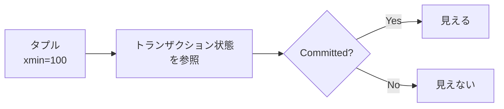
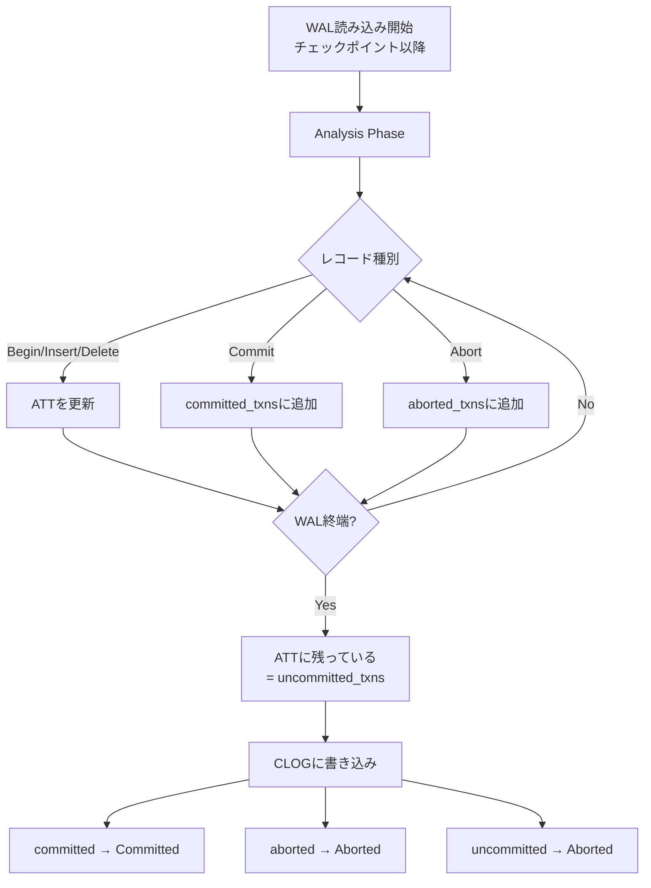

この記事は「[一人自作RDBMS Advent Calendar 2025](https://qiita.com/advent-calendar/2025/my-own-rdbms)」15日目の記事です。

本日の実装は[GitHub](https://github.com/gtnao/advent-calendar-2025-my-own-rdbms/tree/main/day15)にあります。昨日からの差分は以下のコマンドで確認できます。

```bash
git diff --no-index day14 day15
```

## 今日のゴール

昨日MVCCを実装しましたが、トランザクション状態（Committed/Aborted）をメモリ上のHashMapで管理していたため、クラッシュすると失われてしまう問題がありました。今日はトランザクション状態を永続化する仕組みを実装します。

## なぜトランザクション状態の永続化が必要か

MVCCの可視性判定では、タプルのxmin/xmaxに記録されたトランザクションIDを元に「そのトランザクションがCommitしたか」を判定します。この情報がメモリ上にしかないと、クラッシュ後のリカバリ時に可視性判定ができません。



この「トランザクション状態」がメモリ上にしかないと、クラッシュ後に失われてしまいます。そのため、ディスクに永続化する必要があります。

PostgreSQLではこの仕組みを**CLOG（Commit Log）** と呼び、`pg_xact`ディレクトリ（旧`pg_clog`）に保存しています。今回はPostgreSQLに倣い、この仕組みをCLOGと呼ぶことにします。

## 設計

各トランザクションに必要な状態は3種類（InProgress/Committed/Aborted）なので、**2ビット**で表現できます。PostgreSQLのCLOGもこの方式を採用しており、今回も同様に実装します。

| 値  | 状態       |
| --- | ---------- |
| 00  | InProgress |
| 01  | Committed  |
| 10  | Aborted    |

1バイトに4トランザクション分の状態を格納できるため、4KBのページで16,384トランザクション分の状態を管理できます。

## ページ構造

今回はページベースで管理します。これはバッファプールを使った効率的なアクセスを可能にするためです。

```
CLOG Page (4KB):
┌─────────────────────────────────────────────────────────────┐
│ Byte 0: [TxnID 3][TxnID 2][TxnID 1][TxnID 0]               │
│         2bits    2bits    2bits    2bits                    │
├─────────────────────────────────────────────────────────────┤
│ Byte 1: [TxnID 7][TxnID 6][TxnID 5][TxnID 4]               │
├─────────────────────────────────────────────────────────────┤
│ ...                                                         │
├─────────────────────────────────────────────────────────────┤
│ Byte 4095: [TxnID 16383][TxnID 16382][TxnID 16381][TxnID 16380] │
└─────────────────────────────────────────────────────────────┘
```

トランザクションIDからページ内の位置を計算します：

- **ページID** = txn_id / 16384
- **バイトオフセット** = (txn_id % 16384) / 4
- **ビット位置** = (txn_id % 4) \* 2

## 実装

### Clog構造体

[Day03で実装したBufferPool](https://zenn.dev/primenumber/articles/ac-2025-my-own-rdbms-03)と同じ仕組みで、ページをメモリにキャッシュしLRU置換アルゴリズムでメモリ使用量を制限しています。

```rust
const PAGE_SIZE: usize = 4096;
const TXNS_PER_PAGE: u64 = (PAGE_SIZE * 4) as u64; // 16384
const BUFFER_SIZE: usize = 8; // Number of pages to keep in memory

pub struct Clog {
    inner: Mutex<ClogInner>,
}

struct ClogInner {
    file_path: PathBuf,
    frames: Vec<ClogFrame>,
    page_table: HashMap<u64, usize>, // page_id -> frame_id
    replacer: LruReplacer,
    page_count: u64,
}
```

### ステータスの取得

トランザクションIDから対応するページをフェッチし、ビット演算でステータスを取得します。

```rust
pub fn get_status(&self, txn_id: TxnId) -> TxnStatus {
    let page_id = txn_id / TXNS_PER_PAGE;
    let mut inner = self.inner.lock().unwrap();

    let frame_id = match inner.fetch_page(page_id) {
        Ok(id) => id,
        Err(_) => return TxnStatus::InProgress,
    };

    let offset = ((txn_id % TXNS_PER_PAGE) / 4) as usize;
    let bit_pos = ((txn_id % 4) * 2) as u8;
    let status_bits = (inner.frames[frame_id].data[offset] >> bit_pos) & 0b11;

    inner.unpin(frame_id);

    match status_bits {
        0b01 => TxnStatus::Committed,
        0b10 => TxnStatus::Aborted,
        _ => TxnStatus::InProgress,
    }
}
```

### ステータスの設定

Commit/Abort時に呼び出され、対応するビットを更新します。

```rust
pub fn set_status(&self, txn_id: TxnId, status: TxnStatus) {
    let page_id = txn_id / TXNS_PER_PAGE;
    let mut inner = self.inner.lock().unwrap();

    let frame_id = match inner.fetch_page_mut(page_id) {
        Ok(id) => id,
        Err(_) => return,
    };

    let offset = ((txn_id % TXNS_PER_PAGE) / 4) as usize;
    let bit_pos = ((txn_id % 4) * 2) as u8;

    let status_bits = match status {
        TxnStatus::Committed => 0b01,
        TxnStatus::Aborted => 0b10,
        TxnStatus::InProgress => 0b00,
    };

    // Clear the 2 bits and set new value
    inner.frames[frame_id].data[offset] &= !(0b11 << bit_pos);
    inner.frames[frame_id].data[offset] |= status_bits << bit_pos;
    inner.frames[frame_id].is_dirty = true;

    inner.unpin(frame_id);
}
```

### TransactionManagerの変更

HashMapをCLOGに置き換えます。

```rust
pub struct TransactionManager {
    next_txn_id: AtomicU64,
    att: Mutex<HashMap<u64, Lsn>>,
    clog: Arc<Clog>,  // HashMap<TxnId, TxnStatus> から変更
}

impl TransactionManager {
    pub fn commit(&self, txn_id: u64) {
        self.att.lock().unwrap().remove(&txn_id);
        self.clog.set_status(txn_id, TxnStatus::Committed);
    }

    pub fn abort(&self, txn_id: u64) {
        self.att.lock().unwrap().remove(&txn_id);
        self.clog.set_status(txn_id, TxnStatus::Aborted);
    }

    pub fn get_txn_status(&self, txn_id: TxnId) -> TxnStatus {
        self.clog.get_status(txn_id)
    }
}
```

### チェックポイントとCLOG

チェックポイント時には以下の処理を行います：

1. **CLOGのフラッシュ**: ダーティページをディスクに書き込む
2. **next_txn_idの保存**: リカバリ時はチェックポイント以降のWALしか読まないため、チェックポイント後にトランザクションがなかった場合にnext_txn_idが不明になる

```rust
// Flush CLOG to disk
txn_manager.clog().flush()?;

// Write checkpoint metadata (LSN and next_txn_id)
let next_txn_id = txn_manager.get_next_txn_id();
checkpoint::write_checkpoint_meta(DATA_DIR, checkpoint_lsn, next_txn_id)?;
```

チェックポイント時点でCLOGがフラッシュされていれば、リカバリ時はチェックポイント以降のWALだけを見ればよくなります。

### リカバリフロー

クラッシュからのリカバリ時、WALを再生してトランザクション状態を復元します。



WALのAnalysis Phaseで各トランザクションの最終状態を把握し、CLOGに反映します。

- **Commitレコードがある**: Committedとして記録
- **Abortレコードがある**: Abortedとして記録
- **どちらもない（ATTに残っている）**: クラッシュ時に未コミットだったため、Abortedとして記録

```rust
// committed_txns: WALでCommitレコードが見つかったトランザクション
for txn_id in &analysis.committed_txns {
    txn_manager.set_txn_status(*txn_id, TxnStatus::Committed);
}

// aborted_txns: WALでAbortレコードが見つかったトランザクション
for txn_id in &analysis.aborted_txns {
    txn_manager.set_txn_status(*txn_id, TxnStatus::Aborted);
}

// uncommitted_txns: WALにCommit/Abortがなかったトランザクション
// Undo Phaseでロールバック済みなのでAbortedとして記録
for txn_id in &analysis.uncommitted_txns {
    txn_manager.set_txn_status(*txn_id, TxnStatus::Aborted);
}
```

## 動作確認

### Test 1: CLOGの永続化

```bash
cargo run -- --init

# Terminal 1
psql -h localhost -p 5433
BEGIN;
INSERT INTO users VALUES (1, 'Alice');
COMMIT;
```

サーバーを強制終了（Ctrl+C）して再起動します。

```bash
cargo run
```

```bash
# Terminal 1
psql -h localhost -p 5433
SELECT * FROM users;
```

```
 id | name
----+-------
  1 | Alice
(1 row)
```

Commit状態が永続化されているため、リカバリ後もAliceが見えます。

### Test 2: 未コミットトランザクションのリカバリ

```bash
cargo run -- --init

# Terminal 1
psql -h localhost -p 5433
BEGIN;
INSERT INTO users VALUES (1, 'Alice');
-- COMMITしない
```

サーバーを強制終了（Ctrl+C）して再起動します。

```bash
cargo run
```

```bash
# Terminal 1
psql -h localhost -p 5433
SELECT * FROM users;
```

```
 id | name
----+------
(0 rows)
```

未コミットのトランザクションはリカバリ時にAbortedとして記録されるため、Aliceは見えません。

## 次回予告

9日目から7日間かけてトランザクション周りを実装してきました。Vacuumが未実装だったりとまだまだ不完全ではありますが、分離レベルやクラッシュリカバリなど一通りの機能を実装できました。

次回からは、Aggregate（GROUP BY）やJOIN、テーブルのカタログ管理など、一般的なDBに必要な機能をいくつか実装した後、Indexの実装に入っていきます。
