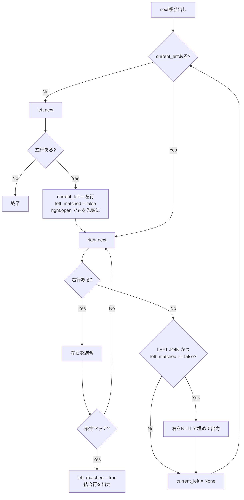

この記事は「[一人自作RDBMS Advent Calendar 2025](https://qiita.com/advent-calendar/2025/my-own-rdbms)」17日目の記事です。

本日の実装は[GitHub](https://github.com/gtnao/advent-calendar-2025-my-own-rdbms/tree/main/day17)にあります。昨日からの差分は以下のコマンドで確認できます。

```bash
git diff --no-index day16 day17
```

## 今日のゴール

昨日システムカタログを実装し、複数テーブルを扱えるようになりました。今日は**JOIN**を実装し、複数テーブルを結合したクエリを実行できるようにします。

## JOINアルゴリズム

JOINの実装方法には主に3つのアルゴリズムがあります。

### Nested Loop Join

最も単純なアルゴリズムです。外側テーブル（outer）の各行に対して、内側テーブル（inner）を全スキャンします。


図のように、外側テーブルの各行に対して内側テーブルを**毎回全スキャン**します。2行×3行=6回の比較が必要で、マッチするのは3組です。

```
for each row r in outer:
    for each row s in inner:
        if r and s satisfy join condition:
            output (r, s)
```

計算量はO(N×M)で、データ量が増えると比較回数が爆発的に増加します。内側テーブルにIndexがあれば、全スキャンをIndex検索に置き換えてO(N log M)に改善できます（Index Nested Loop Join）。

### Hash Join

小さい方のテーブル（build側）で結合キーのハッシュテーブルを構築し、大きい方のテーブル（probe側）をスキャンしながらハッシュルックアップします。


図の左側がBuild Phase、右側がProbe Phaseです。Build Phaseでは小さいテーブルからハッシュテーブルを構築します。Probe Phaseでは大きいテーブルの各行について、結合キーをハッシュ関数にかけて**直接該当バケットにジャンプ**します。

```
// Build phase
for each row r in build_table:
    insert r into hash_table[hash(r.join_key)]

// Probe phase
for each row s in probe_table:
    for each row r in hash_table[hash(s.join_key)]:
        if r.join_key == s.join_key:
            output (r, s)
```

計算量はO(N+M)です。Nested Loop Joinのような全スキャンが不要なため高速ですが、ハッシュテーブル構築にO(N)のメモリが必要です。

### Sort Merge Join

両テーブルを結合キーでソートしてからマージします。


図のように、左右それぞれにポインタがあり、キーを比較して小さい方を進めます。キーが一致したら結果を出力します。**ポインタは常に前進するだけ**で後戻りしないため、各行は最大1回しか参照されません。

```
sort outer by join_key
sort inner by join_key
merge sorted tables
```

計算量はO(N log N + M log M)です。既にソート済みの場合（Indexがある場合など）はソートをスキップでき、O(N+M)になります。

### 今回の選択

今回は**Nested Loop Join**を実装します。O(N×M)と効率は良くありませんが、実装が最も単純です。将来Indexを実装したらIndex Nested Loop Joinに拡張できます。

また、`t1 JOIN t2 ON ... JOIN t3 ON ...`のような複数JOINの連鎖と、`users.id`のようなテーブル修飾付きカラム参照もサポートします。

## 実装

### FROM句のパース

FROM句をJOINを含む形にパースできるよう拡張します。

```rust
pub enum FromClause {
    Table(TableRef),
    Join {
        left: Box<FromClause>,
        right: TableRef,
        join_type: JoinType,
        condition: Expr,
    },
}
```

`Box<FromClause>`を使うことで、複数JOINを再帰的に表現できます。例えば以下のSQL：

```sql
SELECT * FROM users
JOIN orders ON users.id = orders.user_id
JOIN products ON orders.product_id = products.id;
```

は以下のような木構造のASTになります（左結合）：

```
          Join
         /    \
      Join   products
     /    \     ON orders.product_id = products.id
  users  orders
           ON users.id = orders.user_id
```

### カラム参照の解決

JOINでは複数テーブルに同名のカラムがある場合があります（例：`users.id`と`orders.id`）。Analyzerでテーブル修飾付きカラム参照を解決できるようにします。

```rust
pub enum Expr {
    Column {
        table: Option<String>,  // テーブル名（省略可）
        name: String,
    },
    // ...
}
```

テーブル名が指定されていればそのテーブルから、省略されていれば全テーブルから一意に解決します（複数テーブルに同名カラムがあれば曖昧としてエラー）。

### Nested Loop Join Executor

Executorは以下の状態を持ちます。

| 変数           | 説明                                                |
| -------------- | --------------------------------------------------- |
| `current_left` | 現在処理中の左タプル（None なら次の左タプルを取得） |
| `left_matched` | 現在の左タプルが右テーブルのいずれかとマッチしたか  |

主要な操作：

- `left.next()` / `right.next()`: 左/右のExecutorから次のタプルを取得
- `right.open()`: 右テーブルを先頭から再スキャン（左の行が変わるたびに呼ぶ）

これらを使った実行フローです。



```rust
fn next(&mut self) -> Result<Option<Tuple>> {
    loop {
        if self.current_left.is_none() {
            match self.left.next()? {
                Some(left_tuple) => {
                    self.current_left = Some(left_tuple);
                    self.left_matched = false;  // 新しい左行、まだマッチしていない
                    self.right.open()?;         // 右テーブルを最初から再スキャン
                }
                None => return Ok(None),  // 左テーブル終了
            }
        }

        let left_tuple = self.current_left.as_ref().unwrap().clone();

        match self.right.next()? {
            Some(right_tuple) => {
                let combined = self.combine_tuples(&left_tuple, &right_tuple);
                if evaluate_predicate(&self.condition, &combined)? {
                    self.left_matched = true;  // マッチした
                    return Ok(Some(combined));
                }
                // マッチしなければ次の右行へ
            }
            None => {
                // 右テーブルを全部見終わった
                if self.join_type == JoinType::Left && !self.left_matched {
                    // LEFT JOIN かつ マッチしなかった → NULLで埋めて出力
                    let right_null = self.make_right_null_tuple();
                    let combined = self.combine_tuples(&left_tuple, &right_null);
                    self.current_left = None;
                    return Ok(Some(combined));
                }
                self.current_left = None;  // 次の左行へ
            }
        }
    }
}
```

## 動作確認

```bash
cargo run -- --init
psql -h localhost -p 5433
```

### テストデータの準備

```sql
CREATE TABLE users (id INT, name VARCHAR);
CREATE TABLE orders (id INT, user_id INT, amount INT);

INSERT INTO users VALUES (1, 'Alice');
INSERT INTO users VALUES (2, 'Bob');
INSERT INTO users VALUES (3, 'Charlie');

INSERT INTO orders VALUES (100, 1, 500);
INSERT INTO orders VALUES (101, 1, 300);
INSERT INTO orders VALUES (102, 2, 1000);
```

### INNER JOIN

```sql
SELECT * FROM users JOIN orders ON users.id = orders.user_id;
```

```
 id | name  | id  | user_id | amount
----+-------+-----+---------+--------
  1 | Alice | 100 |       1 |    500
  1 | Alice | 101 |       1 |    300
  2 | Bob   | 102 |       2 |   1000
(3 rows)
```

### LEFT JOIN

```sql
SELECT * FROM users LEFT JOIN orders ON users.id = orders.user_id;
```

```
 id | name    | id  | user_id | amount
----+---------+-----+---------+--------
  1 | Alice   | 100 |       1 |    500
  1 | Alice   | 101 |       1 |    300
  2 | Bob     | 102 |       2 |   1000
  3 | Charlie |     |         |
(4 rows)
```

### テーブル別名

```sql
SELECT u.name, o.amount FROM users u JOIN orders o ON u.id = o.user_id;
```

```
 name  | amount
-------+--------
 Alice |    500
 Alice |    300
 Bob   |   1000
(3 rows)
```

## 今後の課題

- **Index Nested Loop Join**: Indexを実装したら、内側テーブルの全スキャンをIndex検索に置き換えてO(N log M)に改善可能

## 次回予告

今日でJOINを実装し、複数テーブルを結合したクエリを実行できるようになりました。

次回は**Aggregate（GROUP BY / COUNT / SUM など）** を実装し、集計クエリに対応します。
