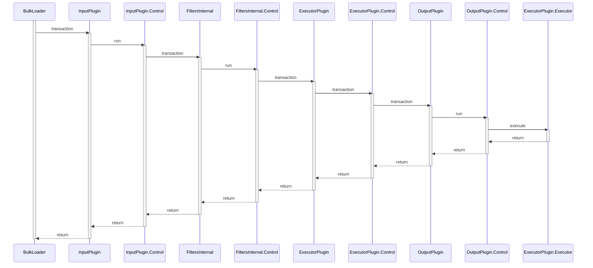
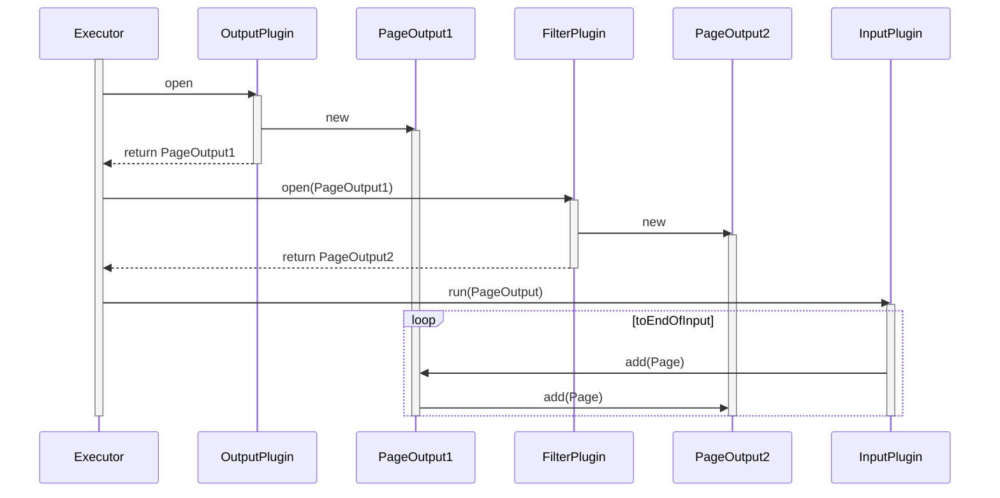

シーケンス図がデカいと縦幅を取るため、記事にはスクショを貼る。
これは確認用。

```mermaid
sequenceDiagram
activate BulkLoader
BulkLoader->>InputPlugin: transaction
activate InputPlugin
InputPlugin->>InputPlugin.Control: run
activate InputPlugin.Control
InputPlugin.Control->>FiltersInternal: transaction
activate FiltersInternal
FiltersInternal->>FiltersInternal.Control: run
activate FiltersInternal.Control
FiltersInternal.Control->>ExecutorPlugin: transaction
activate ExecutorPlugin
ExecutorPlugin->>ExecutorPlugin.Control: transaction
activate ExecutorPlugin.Control
ExecutorPlugin.Control->>OutputPlugin: transaction
activate OutputPlugin
OutputPlugin->>OutputPlugin.Control: run
activate OutputPlugin.Control
OutputPlugin.Control->>ExecutorPlugin.Executor: execute
activate ExecutorPlugin.Executor
ExecutorPlugin.Executor-->>OutputPlugin.Control: return
deactivate ExecutorPlugin.Executor
OutputPlugin.Control-->>OutputPlugin: return
deactivate OutputPlugin.Control
OutputPlugin-->>ExecutorPlugin.Control: return
deactivate OutputPlugin
ExecutorPlugin.Control-->>ExecutorPlugin: return
deactivate ExecutorPlugin.Control
ExecutorPlugin-->>FiltersInternal.Control: return
deactivate ExecutorPlugin
FiltersInternal.Control-->>FiltersInternal: return
deactivate FiltersInternal.Control
FiltersInternal-->>InputPlugin.Control: return
deactivate FiltersInternal
InputPlugin.Control-->>InputPlugin: return
deactivate InputPlugin.Control
InputPlugin-->>BulkLoader: return
deactivate InputPlugin
deactivate BulkLoader
```

```mermaid
sequenceDiagram
activate Executor
Executor->>OutputPlugin: open
activate OutputPlugin
OutputPlugin->>PageOutput1: new
activate PageOutput1
OutputPlugin-->>Executor: return PageOutput1
deactivate OutputPlugin
Executor->>FilterPlugin: open(PageOutput1)
activate FilterPlugin
FilterPlugin->>PageOutput2: new
activate PageOutput2
FilterPlugin-->>Executor: return PageOutput2
deactivate FilterPlugin
Executor->>InputPlugin: run(PageOutput)
activate InputPlugin
loop toEndOfInput
  InputPlugin->>PageOutput1: add(Page)
  PageOutput1->>PageOutput2: add(Page)
end
deactivate InputPlugin
deactivate PageOutput2
deactivate PageOutput1
deactivate Executor
```
